# Building Sokoban on an AVR: From Game Logic to Real-Time Peripheral Integration

Sokoban is not a complicated game to explain.

A player walks around a warehouse, pushes boxes, and tries to place every box on a target. There are no enemies, no physics engine, and no complicated graphics. That simplicity makes it a surprisingly useful embedded-systems project, because almost all of the difficulty comes from **state, timing, I/O, and hardware interaction** rather than visual complexity.

I built my version on an **ATmega324A** in C. The game state was shown on a 16x8 LED matrix, while the same system also interacted with physical push buttons, a serial terminal, a joystick, a two-digit seven-segment display, and a piezo buzzer.

What started as a small puzzle game became a compact exercise in embedded architecture.

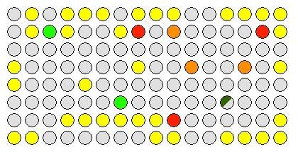

*The warehouse can be reduced to a small number of object types: player, walls, boxes, targets, and empty space.*

The most useful lesson was that a game on a microcontroller is not really about drawing pixels. It is about keeping **one consistent state** while many peripherals observe or modify it.

## The Hardware Was Simple; the State Was Not

The project used a small warehouse map rendered on the LED matrix.

At a logical level, the world only needs a few concepts:

```text
Wall
Target
Box
Player
Empty
```

But some cells contain overlapping meaning.

For example:

```text
player + target
box + target
```

If I represented the screen only as colours, the implementation quickly became awkward. A green pixel could mean a player, a box on a target, or part of an animation.

The better mental model is to separate **game state** from **render state**.

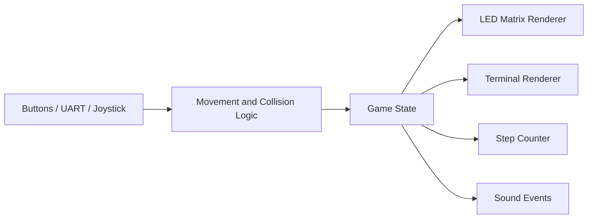

The LED matrix is only one view of the game.

That distinction sounds obvious now, but it was one of the first embedded projects where I clearly saw why separating model and presentation matters.

## Lesson 1 - Do Not Let Display State Become Game State

A tempting implementation is:

```c
if (pixel_is_yellow(next_x, next_y)) {
    // wall
}
```

It works until colours begin to carry multiple meanings.

Targets may flash. A player can stand on a target. A box on a target uses a different colour. The terminal may use a different colour palette from the physical LED matrix.

Instead, movement should operate on the logical warehouse representation:

```c
if (is_wall(next_position)) {
    reject_move();
}
else if (has_box(next_position)) {
    try_push_box();
}
else {
    move_player();
}
```

Rendering happens afterwards.

Conceptually:

```text
Game State
    ↓
render_led_matrix()
render_terminal()
update_seven_segment()
```

This has an important property:

> A change in visual representation does not change the rules of the game.

That becomes especially valuable once animation and alternate displays are introduced.

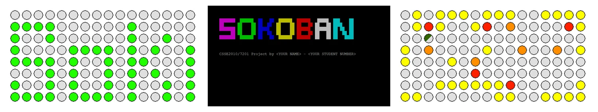

*The same game can be represented through different output surfaces without changing the underlying state.*

## Lesson 2 - One Movement Function Should Serve Every Input Device

The project supported movement from more than one interface.

I used:

- physical push buttons;
- serial terminal input;
- a 2-axis joystick.

The terminal used conventional `W/A/S/D` controls, while the buttons mapped directly to the four cardinal directions.

At first, it is easy to write separate logic:

```text
button right -> move right
terminal 'd' -> move right
joystick east -> move right
```

The problem appears when collision logic becomes more complicated.

If each interface implements its own movement behaviour, eventually one input method handles a box differently from another.

A better structure is:

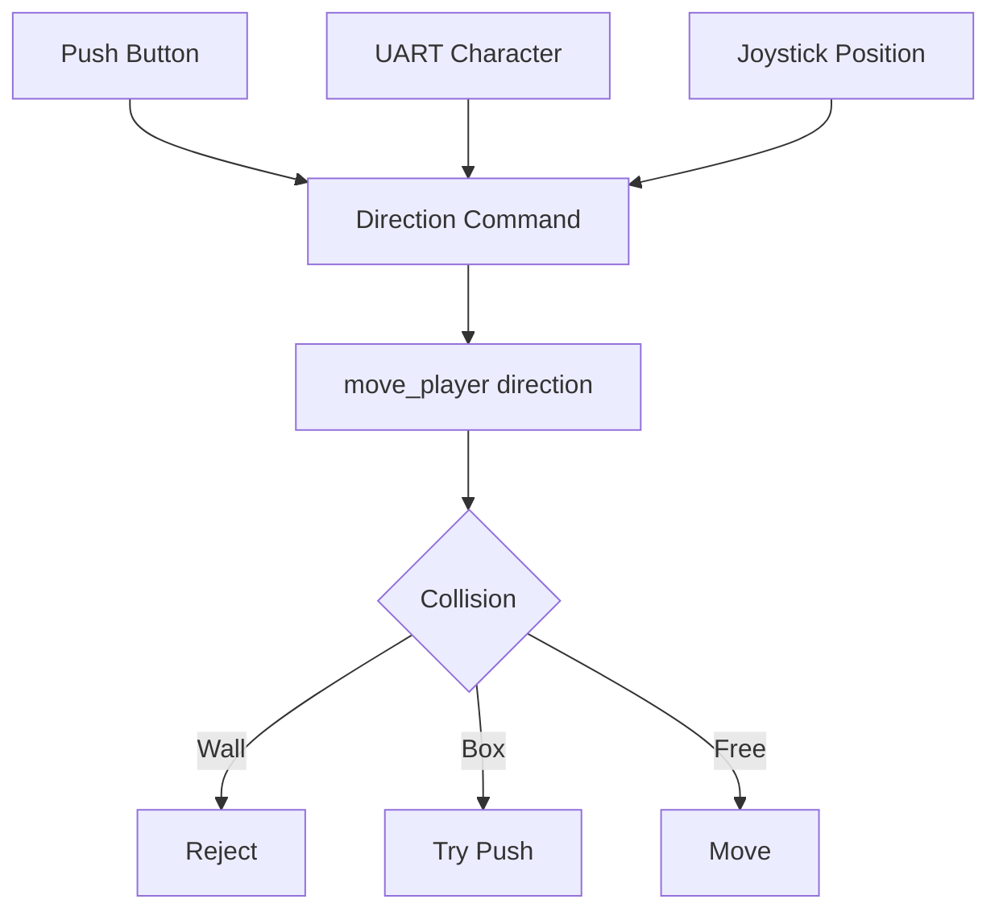

Every frontend should translate physical input into a common command.

For example:

```c
typedef enum {
    MOVE_UP,
    MOVE_DOWN,
    MOVE_LEFT,
    MOVE_RIGHT
} direction_t;
```

Then:

```c
handle_button_input();
handle_uart_input();
handle_joystick_input();
```

can all eventually call the same game-logic function.

This was one of the earliest projects where I learned a principle that I later found useful in much larger systems:

> Hardware interfaces should terminate at a clean software boundary.

## Lesson 3 - Sokoban Collision Logic Is a Small State Machine

Walking into empty space is easy.

Pushing boxes is where the game becomes interesting.

A requested movement can result in several different outcomes:

```text
1. Empty cell        -> player moves
2. Target            -> player moves onto target
3. Wall              -> movement rejected
4. Box + free space  -> box moves, then player moves
5. Box + wall        -> movement rejected
6. Box + box         -> movement rejected
7. Box + target      -> box becomes box-on-target
```

I found it much easier to reason about this as a decision sequence rather than as scattered special cases.

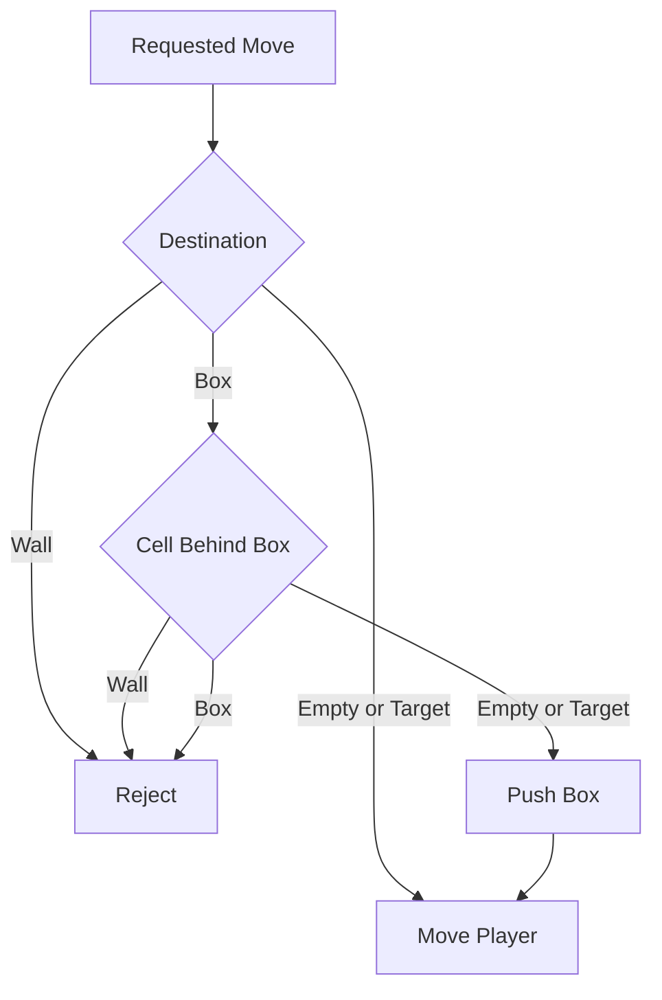

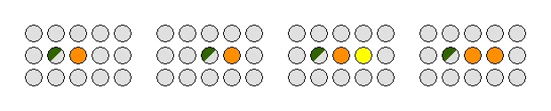

*A valid push, a blocked wall case, and a blocked box case can all be handled by the same movement-validation path.*

A useful detail is to avoid modifying the world until the move has been validated.

In other words:

```text
calculate destination
calculate box destination if needed
validate entire move
commit changes
render
```

rather than:

```text
move player
discover collision
undo part of the move
fix display
```

The first approach produces much cleaner state transitions.

It also makes step counting easier because only a **valid committed move** should increment the count.

## Lesson 4 - Wraparound Makes Coordinate Logic Worth Centralising

The game board allowed movement across the display boundary.

A player walking off one side appears on the opposite side.

For a board with width $W$ and height $H$:

$$
x' = (x + \Delta x + W) \bmod W
$$

$$
y' = (y + \Delta y + H) \bmod H
$$

The extra `+W` or `+H` avoids a negative value before the modulo operation.

This looks like a small implementation detail, but centralising it mattered because wrapping applies not only to the player.

If a player pushes a box at an edge, the box's destination also has to be evaluated using the same coordinate rules.

A helper such as:

```c
position_t wrap_position(int x, int y);
```

is safer than reproducing boundary conditions inside every collision case.

Small helpers like this reduce the number of places where hardware-constrained C code can quietly go wrong.

## Lesson 5 - Real-Time Does Not Mean "Use Delay Everywhere"

The player icon flashes.

Targets can animate.

The level timer updates.

A buzzer may be producing a tone.

The system must still accept input.

This is where blocking delays become dangerous.

A simple implementation such as:

```c
turn_player_on();
_delay_ms(200);
turn_player_off();
_delay_ms(200);
```

makes the animation correct but the game unresponsive.

The better pattern is to compare timestamps:

```c
if (now_ms - last_flash_ms >= FLASH_INTERVAL_MS) {
    player_visible = !player_visible;
    last_flash_ms = now_ms;
}
```

Now the main loop can continue processing:

```text
buttons
UART
joystick
game logic
display
sound
```

between animation events.

The difference is fundamental:

```text
Blocking timing:
do task -> wait -> continue

Non-blocking timing:
check time -> update if due -> continue immediately
```

This project was one of my first practical examples of why embedded timing should usually be **event-driven rather than delay-driven**.

:::important[Responsiveness is a system property]
A function can be individually correct and still make the system wrong if it blocks every other feature while it runs.
:::

## Lesson 6 - Pause Is More Complicated Than Freezing the Main Loop

A pause feature looks trivial until timing state is involved.

If the game pauses halfway through a 200 ms flash cycle, resuming should continue from that point rather than restarting the animation.

Similarly, the level timer should exclude paused time.

That means the program needs to distinguish between:

```text
wall-clock time
```

and:

```text
active gameplay time
```

One simple model is:

$$
T_{\text{game}} =
T_{\text{now}}
-
T_{\text{start}}
-
T_{\text{paused,total}}
$$

When pausing:

```text
pause_start = now
```

When resuming:

```text
total_paused += now - pause_start
```

This was a useful introduction to a broader real-time concept:

> Time is part of program state.

Once timers, animations, and sound depend on elapsed time, "pause" is not merely a boolean.

## Lesson 7 - Multiple Displays Should Read from the Same Source of Truth

The project had three very different output paths:

1. the 16x8 LED matrix;
2. a serial terminal view;
3. a two-digit seven-segment step counter.

The terminal was especially useful because it provided a second representation of the same game and doubled as a debugging interface.

The correct architecture is:

```c
update_game_state();

render_led_matrix();
render_terminal();
render_step_count();
```

If the terminal renderer tries to infer state from the LED output buffer, the software layers become unnecessarily coupled.

The terminal also taught me something useful about bandwidth.

A serial interface is slow compared with writing memory. Redrawing the entire display every loop wastes bandwidth and can create visible latency.

So the correct question is not:

> Can I print the display?

It is:

> How often does the display actually need to change?

That same reasoning applies to embedded dashboards, HMIs, and network telemetry.

## Lesson 8 - Multiplexing a Seven-Segment Display Is a Timing Problem

The step counter used a two-digit seven-segment display.

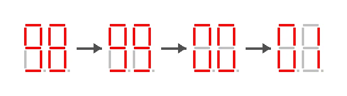

*The visual output wraps at two decimal digits even though the internal step count remains larger.*

Two digits are commonly multiplexed:

```text
show tens
disable
show ones
disable
repeat quickly
```

If the refresh is too slow, the digits flicker.

If both digits are switched incorrectly, ghosting appears.

If display refreshing is performed with blocking code, gameplay responsiveness suffers.

So even a tiny seven-segment display becomes another scheduled real-time task.

The value displayed was only the lower two digits:

$$
D = S \bmod 100
$$

where $S$ is the full step count.

Importantly, the internal step count should not itself wrap at 100 because the final game score may need the true number of steps.

This is another example of the difference between:

```text
internal state
```

and:

```text
display representation
```

## Lesson 9 - Joystick Input Exposes Weak Movement Abstractions

Adding a joystick changed the movement problem.

Cardinal movement is one step:

```text
north
south
east
west
```

But a diagonal joystick direction represents two orthogonal steps.

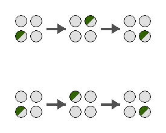

*Two possible intermediate paths can produce the same diagonal result, so the intermediate collision state matters.*

For example, north-east can be decomposed as:

```text
east -> north
```

or:

```text
north -> east
```

The intermediate square matters because a wall may block one ordering but not the other.

The project rules also disallowed diagonal box pushes.

This feature exposed whether movement logic was truly reusable.

If the basic movement routine is clean, diagonal movement can reuse it.

If movement and input handling are tangled together, the joystick feature forces a major rewrite.

That was a useful architecture test.

A feature that should be an extension becomes difficult when the original abstraction was wrong.

## Lesson 10 - Sound Effects Must Be Asynchronous

The piezo buzzer added feedback for game events such as movement, invalid moves, box actions, startup, or game completion.

The easiest implementation is also the worst:

```c
tone(440);
_delay_ms(100);
tone(660);
_delay_ms(100);
```

Now input handling stops for 200 ms.

A better sound engine keeps track of:

```text
current tone
tone duration
sequence index
next update time
mute state
```

and advances the sequence from the normal event loop.

Conceptually:

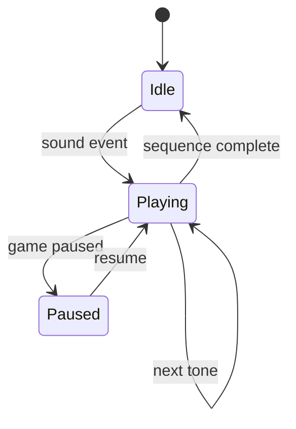

The important idea is not audio itself.

It is that every new peripheral is another asynchronous activity competing for the MCU.

## Level Completion Is a Good Test of State Consistency

A level is complete when every target contains a box.

The final state should be internally consistent before the victory screen is shown.

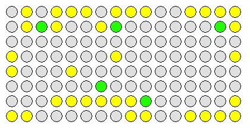

*At level completion, every target contains a box and the remaining state can be used to calculate statistics.*

The score combines step count and elapsed time:

$$
\text{Score}
=
\max(200-S,0)\times20
+
\max(1200-T,0)
$$

where:

- $S$ is the full number of steps;
- $T$ is elapsed gameplay time in seconds.

This was another reason not to let UI representations replace the underlying state.

The seven-segment display may show:

```text
03
```

but the real step count could be:

```text
103
```

The gameplay model must keep the full value.

The project also introduced a second level, which is a good reminder that level data should be treated as data rather than hard-coded behaviour.

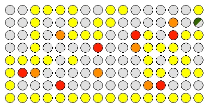

*A second layout uses the same engine but different initial world data.*

## The Architecture I Would Use Today

If I rewrote the project now, I would structure it into four layers.

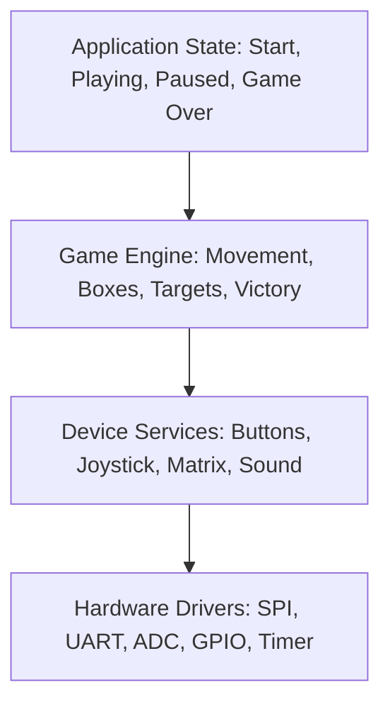

### Hardware drivers

Responsible only for things such as:

```text
SPI
UART
GPIO
ADC
timers
PWM
```

### Device services

Translate hardware into useful concepts:

```text
read_joystick_direction()
button_pressed()
display_board()
set_step_count()
play_sound()
```

### Game engine

Should know nothing about AVR registers.

It should operate on:

```text
positions
walls
boxes
targets
moves
```

### Application state machine

Controls:

```text
START
PLAYING
PAUSED
GAME_OVER
```

This separation would make the game logic much easier to test on a PC without any hardware.

:::tip[The test I now use for embedded architecture]
If a pure logic module cannot be compiled without including MCU register headers, hardware and application logic are probably too tightly coupled.
:::

## What I Would Improve in a Second Version

### 1. Use explicit event objects

Instead of output modules checking the game state independently, the game engine could emit events:

```text
PLAYER_MOVED
MOVE_REJECTED
BOX_PUSHED
BOX_ON_TARGET
LEVEL_COMPLETE
```

The sound and UI systems could react without being embedded inside the movement code.

### 2. Create a single scheduler for periodic tasks

Rather than giving every feature its own ad-hoc timing checks, I would centralise periodic scheduling for:

```text
player flashing
target animation
seven-segment multiplexing
sound sequencing
level-time refresh
```

### 3. Unit-test the movement engine on a computer

Collision rules are deterministic and do not require real hardware.

I would create small board states and test cases such as:

```text
push box into wall -> rejected
push box onto target -> valid
walk through edge -> wrapped
diagonal joystick move into box -> rejected
```

### 4. Keep peripheral code extremely small

The more work that happens inside interrupt handlers and device drivers, the harder the whole game becomes to reason about.

### 5. Treat debugging interfaces as first-class features

The UART terminal was useful not only as a user interface but also as a debugging window into the system.

In future embedded projects, I would deliberately design diagnostics instead of adding `printf()` calls only when something breaks.

## Final Thoughts

This project was small enough that I could understand almost every line of the system, but large enough to expose the problems that appear when multiple peripherals share one microcontroller.

I started the project thinking mainly about C and AVR registers.

I finished it thinking much more about:

- state ownership;
- abstraction boundaries;
- non-blocking timing;
- reusable input paths;
- deterministic game rules;
- multi-display consistency;
- peripheral scheduling.

That shift mattered more than any individual feature.

The LED matrix, joystick, terminal, seven-segment display, and buzzer were all useful, but the real engineering challenge was making them behave as **one coherent system**.

The lesson I kept from Sokoban is:

> On a microcontroller, complexity rarely comes from one difficult algorithm. It comes from many simple things needing to remain correct at the same time.

That idea has followed me into every larger embedded and real-time project I have worked on since.
