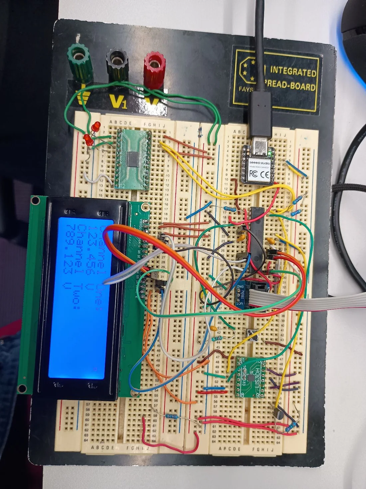
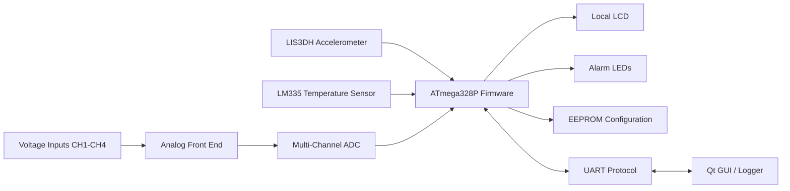
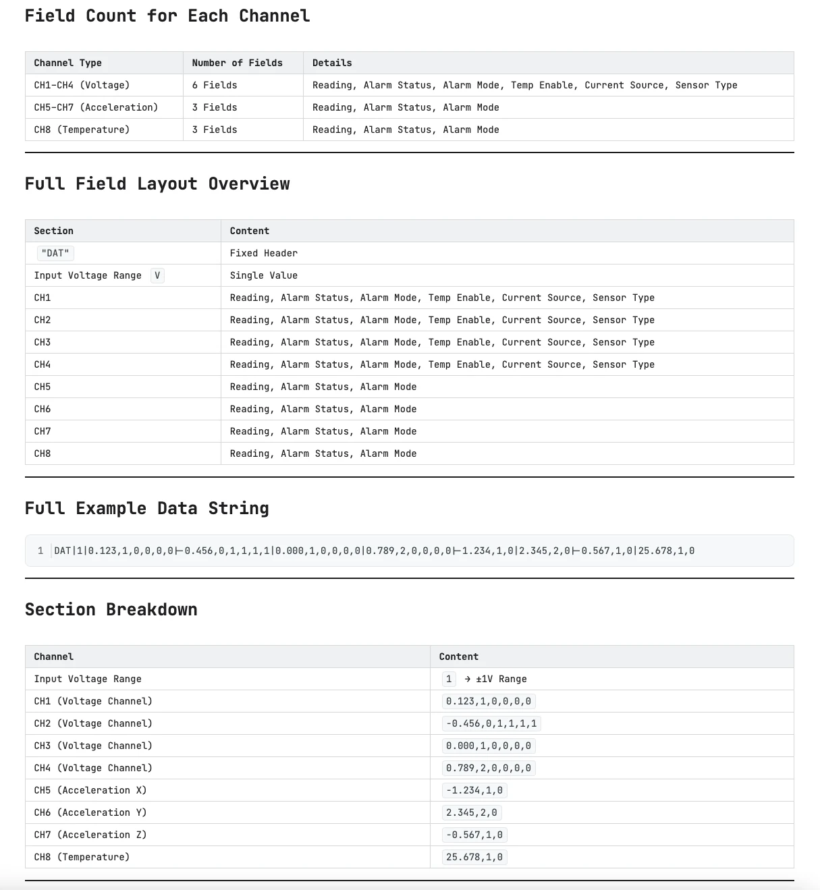
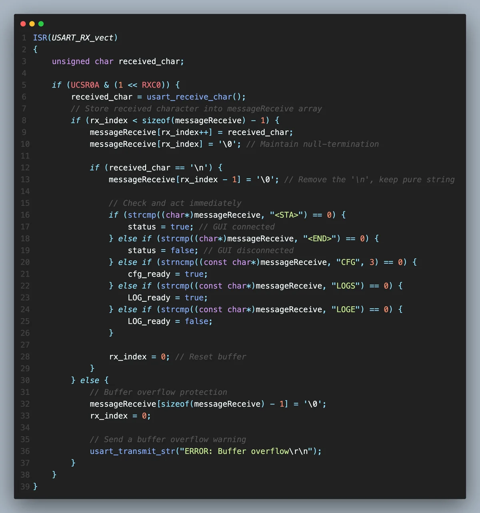
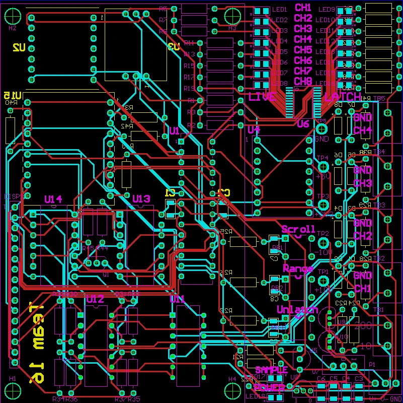
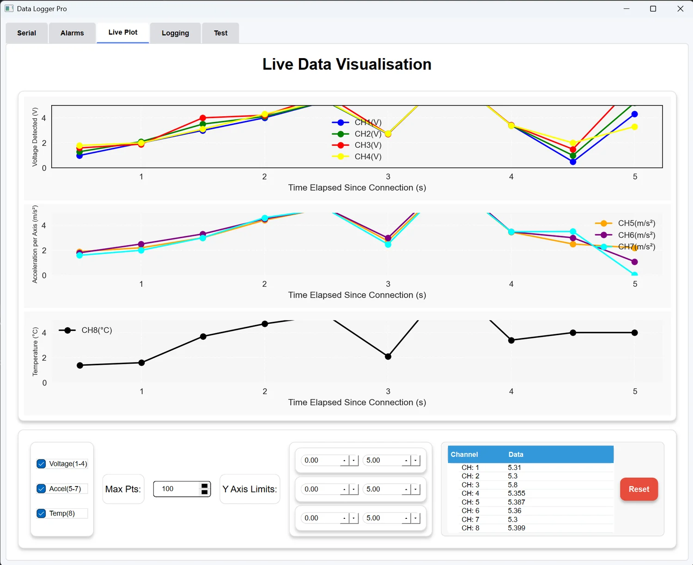

# Building a Real-Time Embedded DAQ System: Lessons from Firmware, Sensors, and Integration

Some embedded projects look simple when reduced to a block diagram: sample a few signals, process them on a microcontroller, and send the values to a PC. In practice, the difficult part is rarely a single peripheral or a single function. The real challenge is making **hardware, firmware, timing, communication, and user-facing software behave like one system**.

I learned this while working on an industrial-style multi-channel data acquisition system. The final prototype combined voltage acquisition, acceleration and temperature sensing, configurable alarms, non-volatile settings, a local LCD interface, and a Qt-based desktop application for visualization and logging.

My main responsibility was the firmware side of the project, especially sensor integration, alarm control, EEPROM configuration, and communication with the GUI. Looking back, the most valuable part of the project was not learning another I2C register map or writing another UART interrupt routine. It was learning how to reason about the **interfaces between modules**.



*An early proof-of-concept prototype used to bring the firmware, display, sensors, and communication path together.*

## System at a Glance

The system was organized around eight logical channels:

| Channels | Signal | Main role |
| --- | --- | --- |
| CH1-CH4 | Voltage | Multi-channel external voltage acquisition |
| CH5-CH7 | Acceleration X/Y/Z | Motion sensing through a 3-axis accelerometer |
| CH8 | Temperature | Board/environment temperature monitoring |

Around these channels, the firmware also had to manage alarm thresholds, alarm modes, display updates, persistent configuration, and serial communication with the PC application.

A simplified view of the architecture is:



This diagram looks clean. The implementation was not.

The system only became reliable after the boundaries between these blocks were treated as engineering contracts rather than informal assumptions.

## Lesson 1 - Requirements Should Drive the Component Choice

One of the largest changes happened around the ADC.

The early plan used a lower-cost ADC because it looked sufficient during initial planning. Once the full sampling requirements were considered, it became clear that the device could not satisfy the required combination of resolution, sampling rate, and simultaneous multi-channel acquisition.

The design was therefore changed to an **ADS8584S**, which supports simultaneous four-channel conversion and a much higher sampling rate.

That change solved one problem but immediately created several new ones:

- more complicated timing control;
- parallel or higher-throughput data handling;
- multi-channel synchronization;
- larger buffering requirements;
- additional firmware states;
- more integration work with the analog front end.

This was an important lesson for me: **a cheaper or simpler part is not actually simpler if it pushes complexity into the rest of the system**.

A component decision should not be evaluated only by unit price or headline specifications. I now try to ask four questions much earlier:

1. Does it satisfy the worst-case requirement rather than the nominal case?
2. What new firmware states does it introduce?
3. What timing assumptions does it create?
4. How difficult will it be to verify during integration?

In embedded design, the cost of changing a component late is often much larger than the cost difference between the components themselves.

## Lesson 2 - The Firmware-to-GUI Interface Is an API

My firmware had to continuously exchange configuration and measurement data with the desktop application. At first, it is tempting to think of UART as simply "printing values."

That approach breaks very quickly once both sides become non-trivial.

The GUI needed more than a number. For each channel, it needed context such as current value, alarm state, alarm mode, thresholds, and sensor metadata. The firmware also needed to receive commands for connection state, configuration updates, and logging control.

I therefore treated the serial format as an explicit protocol.



*The communication format defined a fixed layout so the GUI could interpret each channel deterministically.*

A simplified conceptual frame looked like this:

```text
DAT | input-range | CH1 | CH2 | CH3 | CH4 | CH5 | CH6 | CH7 | CH8
```

The important part was not the delimiter itself. The important part was that **both sides agreed on the meaning and order of every field**.

The receive path also used defined command tags rather than arbitrary free-form text. Commands represented events such as:

```text
<STA>    GUI connected
<END>    GUI disconnected
CFG...   configuration update
LOGS     start logging state
LOGE     end logging state
```

This separation made debugging much easier. When something failed, I could ask a precise question:

> Is the sensor value wrong, is the packet wrong, or is the GUI parser wrong?

Without a protocol contract, all three problems can look identical from the user interface.



*The UART receive path parses complete messages and converts them into system-level events.*

:::tip[What I would do differently]
If I rebuilt this system, I would define the protocol document before writing either the firmware parser or the GUI parser. I would also include an explicit protocol version and checksum from the first revision rather than treating them as later improvements.
:::

## Lesson 3 - Sensor Integration Is About Data Meaning, Not Just I2C

The 3-axis accelerometer was one of the more useful examples of why "the communication works" does not mean "the sensor works."

The accelerometer used I2C. At the bus level, the task was straightforward:

1. configure the device;
2. select the output register;
3. read six consecutive bytes;
4. combine low and high bytes;
5. convert the result into signed axis values.

But several details mattered:

- the output data rate;
- the selected measurement range;
- high-resolution mode;
- byte ordering;
- signed conversion;
- update timing;
- how the values were mapped to application channels.

A register transaction can be electrically correct and still produce useless application data.

For this project, the accelerometer values became CH5, CH6, and CH7. That meant the sensor driver also had to fit the timing model and packet model used by the rest of the system.

This changed how I think about drivers. A useful embedded driver is not only:

```c
read_register();
write_register();
```

It should expose **meaningful data at a predictable time**.

For example, the application layer should be able to think in terms of:

```c
accel_update();
get_accel_x();
get_accel_y();
get_accel_z();
```

rather than repeatedly reconstructing low-level transactions.

That boundary becomes increasingly important as a project grows.

## Lesson 4 - "Real-Time" Often Starts with Scheduling Discipline

This system did not need a full RTOS to benefit from real-time thinking.

Different tasks naturally operated at different rates:

- alarm checking needed relatively frequent updates;
- environmental and motion sensors could update more slowly;
- serial command parsing had to remain responsive;
- display and GUI transmission had their own update cadence.

A simplified main-loop structure looked conceptually like this:

```c title="main-loop.c"
while (1) {
    parse_uart_commands();

    if (elapsed_ms(last_alarm_check) >= 10) {
        update_alarms();
        last_alarm_check = now_ms();
    }

    if (elapsed_ms(last_sensor_update) >= 100) {
        update_temperature();
        update_accelerometer();
        last_sensor_update = now_ms();
    }

    if (gui_connected) {
        transmit_latest_frame();
    }
}
```

The exact implementation details are project-specific, but the principle is general:

> Do not let every module run whenever it wants.

Even a simple cooperative loop becomes much easier to reason about when each task has an expected period and bounded responsibility.

This also made instrumentation easier. We could use a logic analyzer and serial output to check whether a sensor update or transaction was completing within the expected time.

The lesson carried into my later work with RTOS-based and DMA-based systems: an RTOS does not automatically make a system real-time. **Clear timing ownership does.**

## Lesson 5 - Configuration Persistence Changes the Product Experience

The alarm subsystem supported configurable thresholds and modes. Those settings were controlled from the GUI and stored in EEPROM.

This sounds like a small feature, but it changed the character of the device.

Without persistent configuration:

1. power on;
2. connect GUI;
3. re-enter settings;
4. start using the system.

With EEPROM-backed configuration:

1. power on;
2. restore the previous known state;
3. validate it;
4. operate immediately.

I used a validity marker so startup code could distinguish between valid saved data and uninitialized EEPROM. If the configuration was invalid, the firmware fell back to defaults.

Conceptually:

```c title="config.c"
if (eeprom_signature == CONFIG_VALID) {
    load_config_from_eeprom();
} else {
    load_default_config();
}
```

That pattern is simple, but it introduced an important product-level concept: **startup state is part of the interface**.

Embedded systems are often judged by what happens at the boundaries - boot, disconnect, reconnect, reset, sensor failure - rather than only by their steady-state behavior.

## Lesson 6 - Hardware and Software Must Be Integrated Early

One of the biggest sources of wasted time in team projects is waiting until each subsystem is "finished" before integration.

Our system had several independently developed parts:

- analog and digital hardware;
- firmware;
- the PC GUI;
- sensor modules;
- display and alarm logic.

The PCB and the desktop interface were being developed in parallel with the firmware.



*The PCB stage forced firmware assumptions to become concrete pin, voltage, interface, and timing decisions.*

The GUI also made integration issues visible very quickly.



*The desktop interface provided real-time visualization, configuration, and data logging for the embedded system.*

When the GUI displayed a wrong value, the root cause could be almost anywhere:

```text
Sensor
  -> electrical interface
  -> driver
  -> conversion
  -> channel mapping
  -> packet formatting
  -> serial transport
  -> parser
  -> plot
```

That debugging chain is why I now prefer **vertical integration**.

Instead of finishing every driver first, I would rather make one channel work end-to-end:

```text
one sensor -> one firmware path -> one packet field -> one GUI display
```

Then scale the pattern to the remaining channels.

This produces a working reference path early and reduces the number of unknowns during debugging.

:::important[The integration lesson]
A module is not finished when its unit test passes. It is finished when the next module can consume its output reliably.
:::

## What I Would Improve in a Second Version

If I were to redesign the system today, I would keep the same modular direction but make several changes earlier:

### 1. Define protocol versioning from day one

A simple version field would make firmware and GUI compatibility much easier to manage.

### 2. Separate acquisition from presentation more aggressively

Sampling, alarm evaluation, packet generation, and LCD updates should consume a shared data model instead of depending on each other directly.

### 3. Add structured error reporting

Instead of only transmitting measurement frames, I would include explicit status flags for sensor faults, stale data, buffer overflow, configuration errors, and communication timeouts.

### 4. Build an automated protocol test harness

A Python script could emulate the GUI, replay command sequences, and validate outgoing frames without requiring the full desktop application.

### 5. Schedule integration checkpoints

A team integration session every week would have exposed interface mismatches earlier and reduced rework near the end of the project.

## Final Thoughts

This project changed my understanding of embedded systems.

Before building it, I tended to think about firmware mainly in terms of peripherals: ADC, I2C, UART, EEPROM, GPIO.

After building it, I started thinking more in terms of:

- **interfaces;**
- **timing;**
- **state;**
- **data ownership;**
- **failure boundaries;**
- **integration contracts.**

Those concepts are less visible than a schematic or a code listing, but they are what allow a prototype to become a system.

The most useful lesson I took away is simple:

> Good embedded design is not about making every module individually clever. It is about making the boundaries between modules boring, predictable, and easy to debug.

That is a principle I have kept using in later embedded, FPGA, and edge-computing projects.
