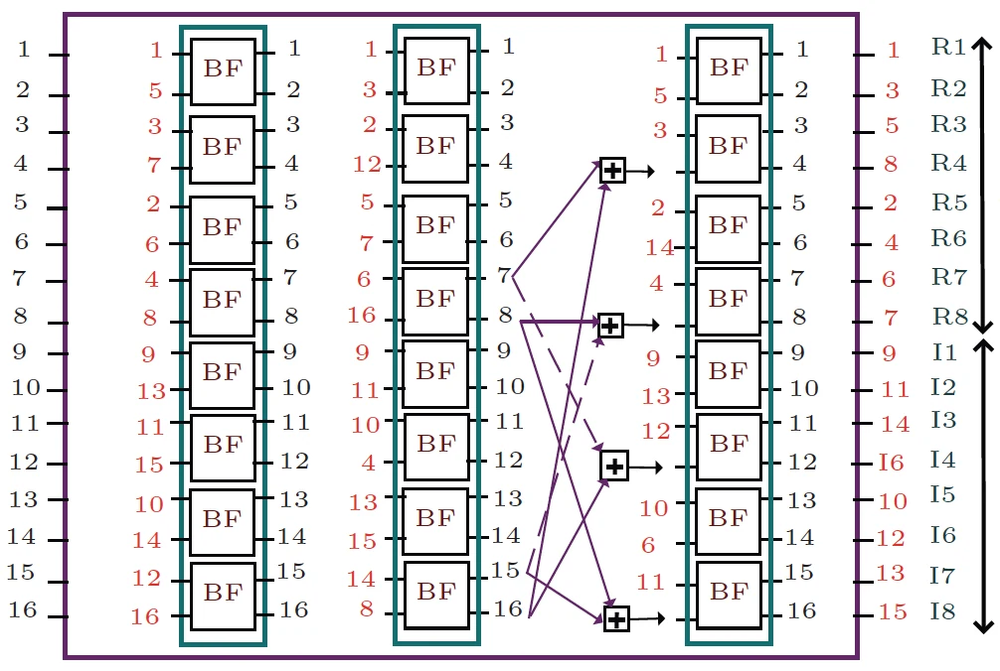
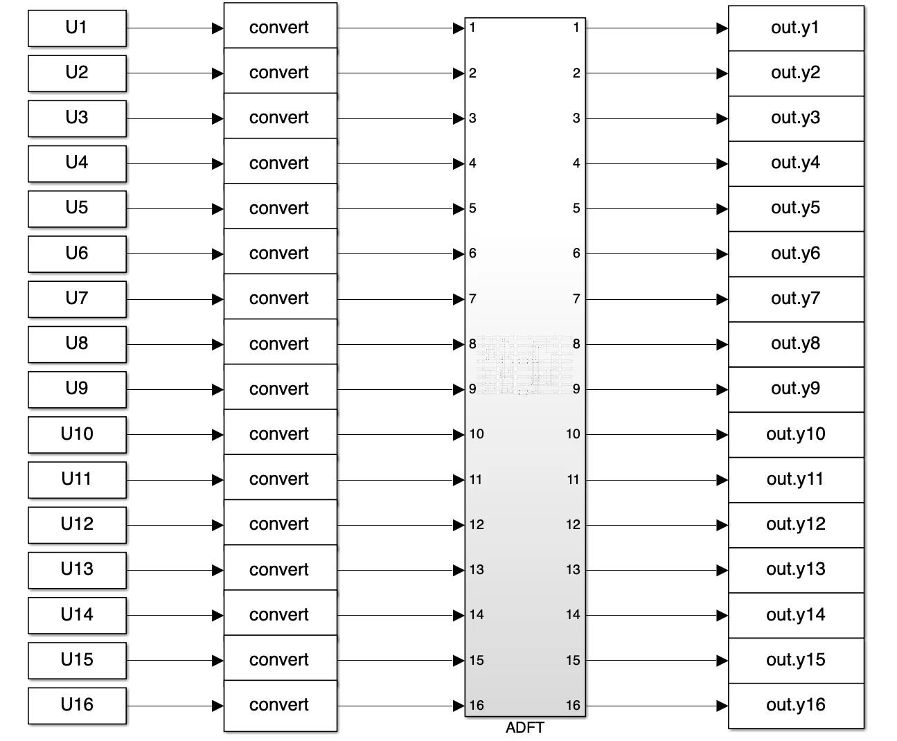
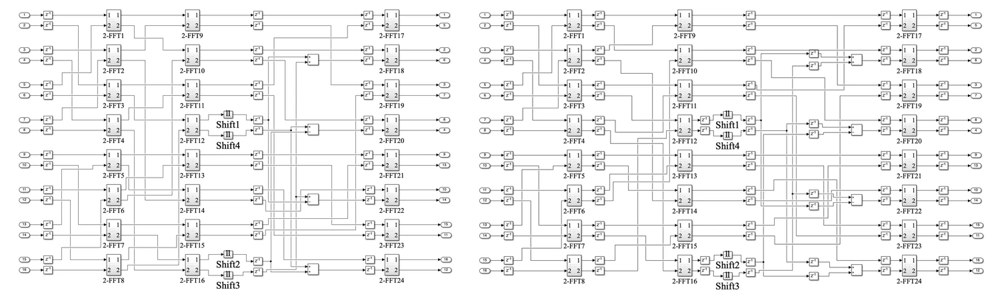
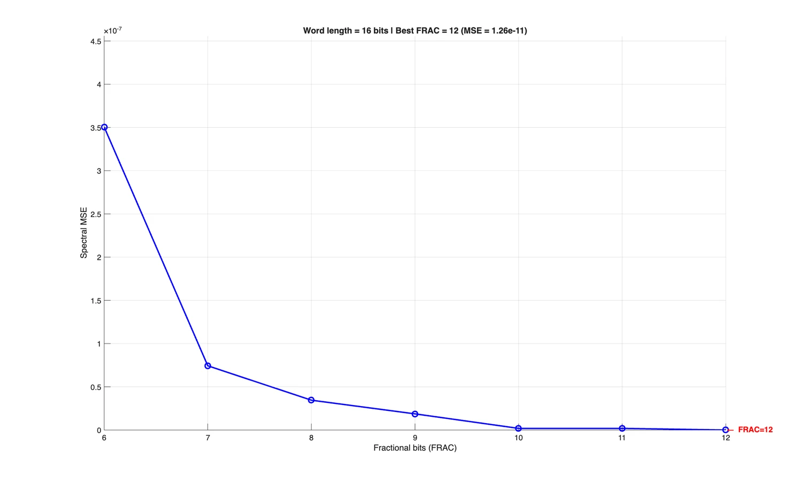
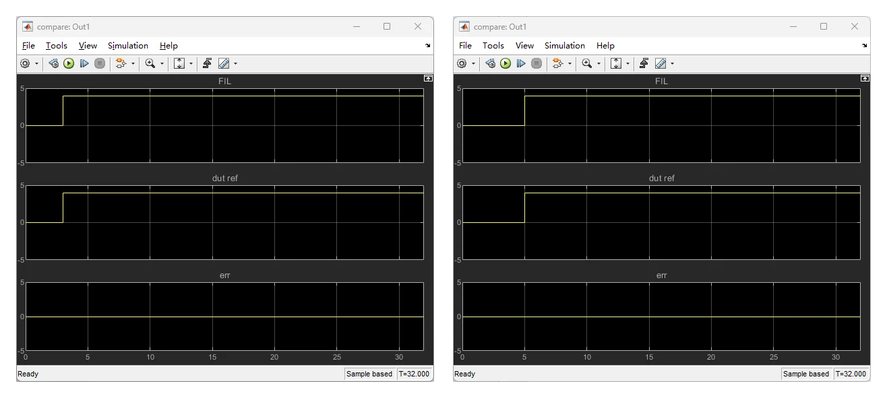
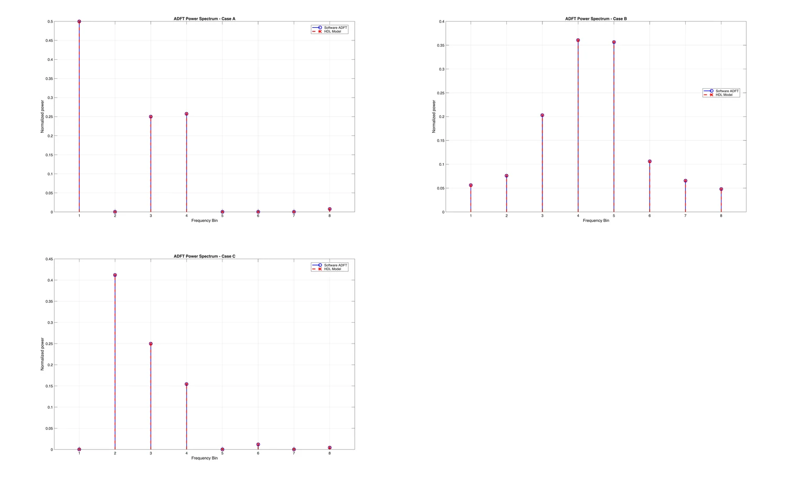
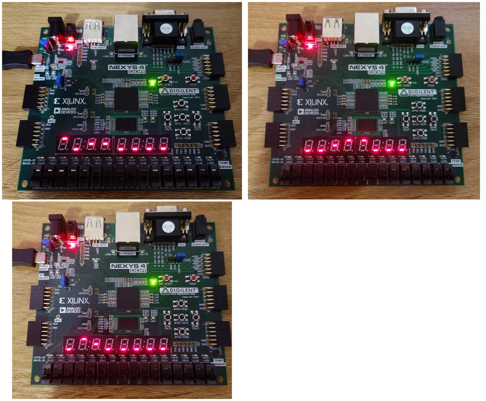

# Designing a Multiplierless ADFT on FPGA: Pipelining, Fixed-Point Arithmetic, and Spectrum Sensing

One of the most useful FPGA exercises I worked through was implementing a small spectrum-sensing pipeline based on an **8-point Approximate Discrete Fourier Transform (ADFT)**.

At the algorithm level, the idea is attractive: instead of implementing a conventional DFT with a large number of complex multiplications, the approximate transform replaces its coefficients with structures that can be realised through **addition, subtraction, and binary shifts**.

That sounds like a straightforward hardware optimisation.

In practice, the more interesting part was everything that came after the equation:

- deciding how to represent the arithmetic in fixed point;
- mapping the transform into a parallel datapath;
- balancing pipeline delays;
- verifying hardware against MATLAB;
- measuring the real critical path after synthesis and routing;
- integrating ROM, SIPO registers, power estimation, and display logic into a standalone FPGA system.

This project gave me a much clearer view of the difference between **an algorithm that is hardware-friendly** and **a hardware architecture that is actually well designed**.



*The transform can be expressed as a butterfly-style network in which constant multiplications are replaced by add/subtract and shift operations.*

## Why Approximate the DFT at All?

For an $N$-point DFT,

$$
X[k] = \sum_{n=0}^{N-1} x[n]e^{-j2\pi kn/N}
$$

the straightforward implementation contains many complex multiplications.

For only eight points, this is not a huge problem on a modern FPGA. But the exercise becomes interesting when the design goal changes from:

> "Can the FPGA calculate this?"

to:

> "Can the transform be expressed using cheaper hardware primitives while preserving the spectral information that matters?"

The ADFT architecture I implemented uses coefficient approximations that reduce the transform to combinations of:

```text
addition
subtraction
right shifts
routing
registers
```

For example:

$$
\frac{1}{2}x = x \gg 1
$$

$$
\frac{1}{4}x = x \gg 2
$$

$$
\frac{3}{4}x = x - (x \gg 2)
$$

The main ADFT core therefore requires no general-purpose multipliers.

That distinction is important. A constant coefficient that happens to be easy to express in binary is not really a "multiplication problem" anymore. It is an **architecture problem**.

## Start with a Software Reference You Trust

Before building the HDL design, I generated several complex-valued test cases in MATLAB and compared the ADFT response with an FFT reference.

The cases covered three useful spectral situations:

```text
Case A - DC plus bin-aligned tones
Case B - off-bin tones with spectral leakage
Case C - multiple bin-aligned tones with unequal amplitudes
```

The per-bin energy metric was:

$$
P_k = a_k^2 + b_k^2
$$

where $a_k$ and $b_k$ are the real and imaginary components of each frequency bin.

The point of the MATLAB stage was not to prove that an FFT works.

It gave me a **golden reference** that stayed unchanged while the hardware implementation evolved.

Later, when something went wrong in Simulink or on the FPGA, I could ask:

> Is this an approximation effect, a fixed-point effect, a pipeline-alignment error, or a hardware integration error?

Without a software reference, those failure modes are difficult to separate.

## Lesson 1 - A Hardware-Friendly Algorithm Still Needs a Hardware Architecture

The mathematical transform does not specify:

- where registers go;
- how wide intermediate values should be;
- when all outputs become valid;
- which paths must be delayed;
- how input samples are framed.

Those decisions belong to the architecture.

The HDL Coder interface used sixteen fixed-point inputs:

```text
8 real samples
8 imaginary samples
```

and produced sixteen outputs:

```text
8 real frequency components
8 imaginary frequency components
```



*The explicit 16-input / 16-output mapping made it easier to compare the mathematical transform, Simulink model, and generated HDL.*

I found this explicit mapping useful because it prevented the interface from hiding too much.

Each signal corresponded to a specific part of the complex vector, so debugging a wrong output bin remained manageable.

A simplified design flow was:


I deliberately keep the Mermaid syntax simple here because it is also much more portable across renderers.

## Lesson 2 - Pipelining Is Not Just Adding Registers

My first hardware version was functionally correct but had long combinational paths.

Several add/subtract operations could be traversed within one clock period. That created a critical path dominated by chained arithmetic.

The unoptimised critical-path estimate was about:

$$
T_{\text{critical}} \approx 6.93\ \text{ns}
$$

After pipelining and delay balancing, the post-implementation path was reduced to approximately:

$$
T_{\text{critical}} \approx 3.13\ \text{ns}
$$

The corresponding routed maximum clock frequency increased from roughly:

$$
146.18\ \text{MHz}
$$

to:

$$
316.86\ \text{MHz}
$$

The result was more than a 2x increase in achievable frequency without changing the transform arithmetic itself.



*The arithmetic is similar in both designs; the important difference is how the combinational work is segmented by registers.*

The lesson was that pipelining has at least three separate jobs.

### Breaking the critical path

A register prevents the next combinational stage from belonging to the same timing path.

Instead of:

```text
adder -> adder -> shift -> adder -> register
```

the architecture becomes closer to:

```text
adder -> register
shift -> register
adder -> register
```

### Balancing data arrival

This part is easier to underestimate.

If one operand reaches an adder after two pipeline stages and another reaches it after three, the arithmetic is wrong even though every individual block is correct.

So shorter paths need explicit delays.

### Defining latency as part of the interface

Once the datapath is pipelined, output timing becomes:

```text
input frame
    ↓
pipeline latency
    ↓
valid output frame
```

Latency is not an implementation detail anymore. Downstream logic has to understand it.

:::important[Pipelining changes time, not the algorithm]
The numerical transformation can remain identical while the temporal behaviour of the module changes completely.
:::

## Lesson 3 - Registers Are Cheap Only If You Remember What They Cost

The pipelined version retained the same basic arithmetic:

```text
56 adders/subtractors
8 static shift operators
0 multipliers in the ADFT core
```

but the register count increased substantially because of pipeline staging and delay balancing.

That is exactly the expected trade-off:

| Design choice | Main effect |
| --- | --- |
| Fewer registers | Lower latency and fewer flip-flops, but longer critical paths |
| More pipeline registers | Higher clock rate and throughput, but more latency and state |
| More parallel arithmetic | Higher throughput, but more area |
| Narrower fixed point | Lower storage/routing cost, but more quantisation risk |

I used to think of pipelining mainly as a performance technique.

This project made me think of it as a **resource exchange**:

> spend registers and latency to buy timing margin.

That framing is much more useful when comparing architectures.

## Lesson 4 - Fixed-Point Design Is Part of the Algorithm

The input samples were represented with a 16-bit fixed-point format using 12 fractional bits.

The difficult part was not writing:

```text
Q1.12
```

in a block parameter.

The difficult part was making sure intermediate arithmetic did not quietly destroy the spectrum.

I considered several issues:

- growth after addition;
- temporary guard bits;
- truncation points;
- rounding mode;
- overflow behaviour;
- final output compatibility with MATLAB.

A useful model is:

$$
x_{\text{fixed}} = \operatorname{round}(x \cdot 2^F)
$$

where $F$ is the number of fractional bits.

Increasing $F$ improves precision, but only until the total word length becomes the limiting factor.

In my numerical sweep, the spectral mean-squared error decreased rapidly as fractional precision increased and reached approximately:

$$
1.26 \times 10^{-11}
$$

at 12 fractional bits.



*The precision sweep helped turn a word-length choice into a measurable engineering decision rather than a guess.*

This is one of the fixed-point habits I now value most:

> Do not choose a format only because it "looks precise enough." Sweep it against a reference and measure the error.

## Lesson 5 - FPGA-in-the-Loop Is More Useful Than I Expected

Simulation can confirm the Simulink model.

Synthesis can confirm that the design maps to hardware.

But neither alone proves that the generated FPGA implementation produces the exact sample stream expected by the software model.

That is where FPGA-in-the-loop verification became useful.

MATLAB supplied the fixed-point inputs, the Nexys 4 executed the ADFT hardware, and the returned outputs were compared with the delayed software reference.

The error was evaluated as:

$$
e[n] = y_{\text{FIL}}[n] - y_{\text{ref}}[n]
$$

After compensating for the pipeline latency, the error remained zero across the verification window.



*Both baseline and optimised designs were compared against the same software reference after compensating for hardware latency.*

The key phrase there is **after compensating for latency**.

Without aligning the streams, even a perfectly correct pipelined design appears wrong.

That reinforced a recurring FPGA lesson for me:

> Correct values at the wrong clock cycle are still incorrect hardware behaviour.

## Lesson 6 - Timing Reports Tell You More Than "Pass" or "Fail"

It is tempting to treat timing analysis as binary:

```text
timing passed
timing failed
```

But the more useful question is:

> What physical structure created the critical path?

In the unoptimised version, the dominant path passed through several arithmetic operations before reaching a register.

That told me exactly what to optimise.

After pipelining, the longest path was reduced to roughly one arithmetic stage between registers.

The main timing comparison was:

| Metric | Unoptimised | Optimised |
| --- | ---: | ---: |
| HDL critical-path estimate | ~6.93 ns | ~3.30 ns |
| Post-implementation delay | ~6.87 ns | ~3.13 ns |
| Post-implementation Fmax | ~146.18 MHz | ~316.86 MHz |
| ADFT multipliers | 0 | 0 |
| ADFT arithmetic structure | add/shift | add/shift |

The important observation is that the frequency gain did not come from replacing the algorithm.

It came from **changing the spatial and temporal structure of the same arithmetic**.

## Lesson 7 - Verification Should Follow the Same Test Cases Across Every Layer

I reused the same representative spectra across:

```text
MATLAB
Simulink functional simulation
FPGA-in-the-loop
standalone FPGA testing
```

That consistency was extremely valuable.



*Representative spectra were kept consistent across software and hardware verification.*

Changing test signals at every stage makes each verification step individually interesting but weakens the end-to-end argument.

Using the same cases lets you trace one expected behaviour through the entire toolchain:

```text
known input spectrum
      ↓
software ADFT
      ↓
fixed-point Simulink
      ↓
generated HDL
      ↓
FPGA-in-the-loop
      ↓
physical board
```

This is a verification strategy I would reuse in future hardware projects.

## Lesson 8 - A Standalone FPGA System Needs Much More Than the Compute Core

Once the ADFT itself worked, the final task was turning it into a standalone spectrum-sensing pipeline.

The complete signal path was:


The ROM stored pre-generated complex samples.

The SIPO registers converted sequential samples into the 8-sample parallel frame expected by the transform.

The power block calculated:

$$
P_k = a_k^2 + b_k^2
$$

and then classified each bin relative to the maximum energy.

The thresholds used were:

$$
T_{\text{mid}} = 0.25P_{\max}
$$

$$
T_{\text{high}} = 0.60P_{\max}
$$

Finally, the eight seven-segment digits represented the eight frequency bins.

Each digit used a simple visual encoding:

```text
top segment    -> High
middle segment -> Mid
bottom segment -> Low
```

I like this architecture because every block has a narrow responsibility.

The ADFT does not know anything about seven-segment displays.

The display driver does not know anything about Fourier transforms.

That separation made the standalone design much easier to debug.

## Lesson 9 - The Peripheral Logic Can Be Small but Still Define the Product

The complete system used only a small fraction of the Artix-7 fabric.

The final implementation occupied roughly:

```text
1896 LUTs       ~2.99%
1991 flip-flops ~1.57%
1 BRAM tile
16 DSP slices in the power-computation stage
```

The ADFT core itself remained multiplierless; the DSP slices in the complete design were associated with the later power calculation.

This distinction matters.

When describing an FPGA design, saying:

> "The system uses DSP slices"

is not the same as saying:

> "The transform requires multipliers."

Architecture-level resource attribution is more informative than quoting only a top-level utilisation number.

## On-Board Results Made the Design Feel Real

The final system ran on the Nexys 4 without MATLAB continuously controlling it.



*The eight seven-segment displays provide a coarse but immediate view of the relative energy distribution across the eight frequency bins.*

The three test cases produced the expected Low/Mid/High patterns on the board.

At that point the system had become:

```text
ROM
 -> SIPO
 -> ADFT
 -> power
 -> classification
 -> display
```

with deterministic timing inside one FPGA clock domain.

This final integration was important because a transform core that passes a unit test is not yet a useful embedded signal-processing system.

The interfaces around it determine whether it can actually consume data and expose a meaningful result.

## What I Would Change in a Second Version

### 1. Add explicit valid/ready signalling

The laboratory version used a deterministic framing structure, but a more reusable core should expose interface-level timing explicitly.

I would prefer something closer to:

```text
input_valid
input_ready
output_valid
```

rather than relying only on known cycle counts.

### 2. Parameterise transform width and data format

Instead of fixing everything around one 8-point, 16-bit configuration, I would separate:

```text
transform size
word length
fractional length
pipeline depth
```

into configurable parameters where practical.

### 3. Compare energy and power directly

The ADFT reduces arithmetic complexity, but a serious low-power study should measure:

```text
dynamic power
static power
energy per frame
throughput per watt
```

rather than inferring efficiency from resource counts alone.

### 4. Stream real input data

The ROM-based test system is excellent for reproducibility.

A natural next step would replace the ROM source with:

```text
ADC
RF front end
DMA/data stream
```

so that the design performs spectrum sensing on live samples.

### 5. Make the verification harness automatic

I would build one script that:

1. generates the MATLAB test vector;
2. exports the fixed-point ROM data;
3. runs HDL/FIL verification;
4. compensates latency automatically;
5. computes error metrics;
6. produces the comparison figures.

That would make architecture iteration much faster.

## Final Thoughts

This project changed how I think about FPGA optimisation.

At first, the most interesting idea seemed to be the multiplierless ADFT itself.

By the end, I found the architectural lessons more valuable:

- a hardware-friendly equation is only the beginning;
- pipelining is a deliberate exchange between timing, latency, and registers;
- delay balancing is just as important as inserting registers;
- fixed-point precision should be measured, not guessed;
- verification has to account for time as well as value;
- resource reports are most useful when interpreted by module;
- a compute core becomes useful only after it is integrated into a complete data path.

The biggest lesson I kept is:

> FPGA performance often improves not because the arithmetic changes, but because the same arithmetic is reorganised in space and time.

That idea now influences how I look at DSP accelerators, hardware pipelines, and almost any architecture intended for real-time FPGA implementation.
