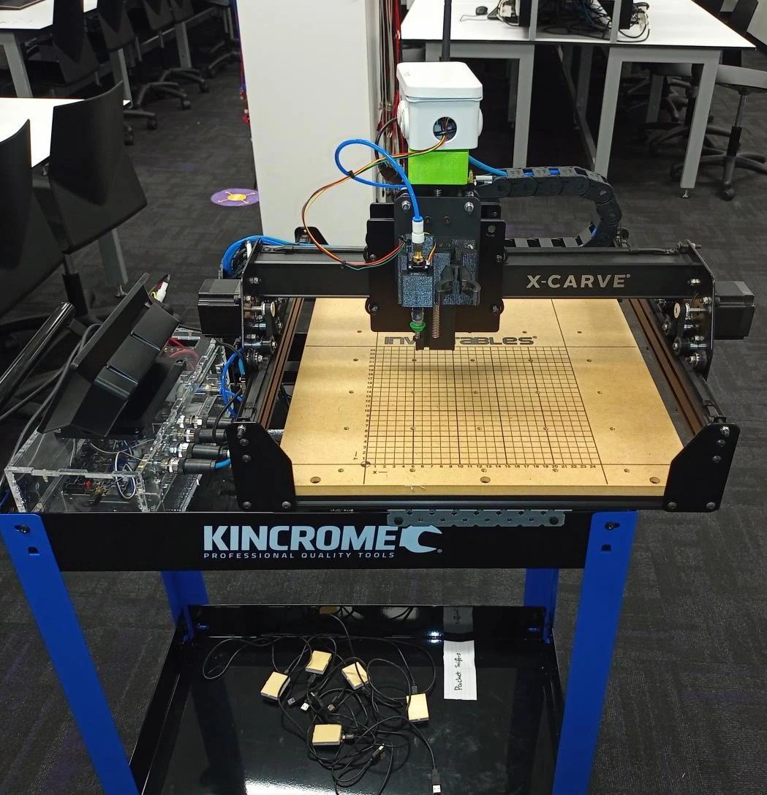
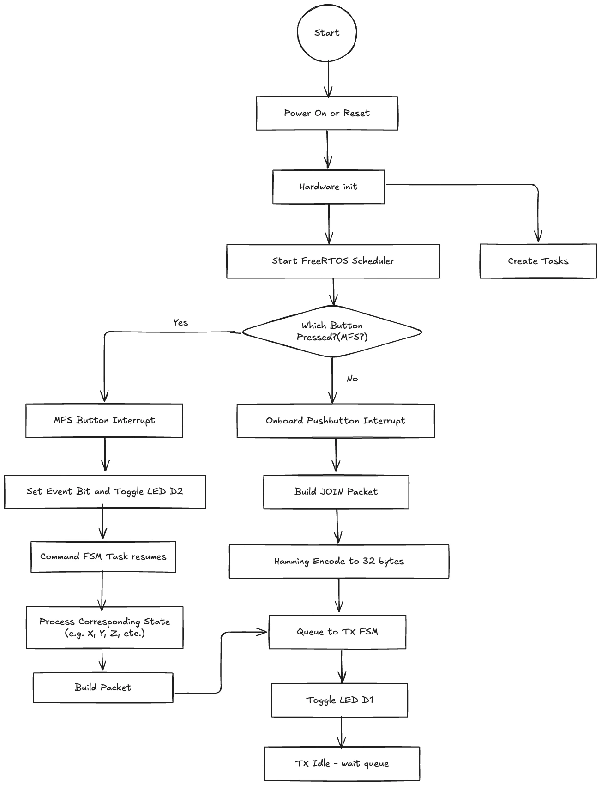
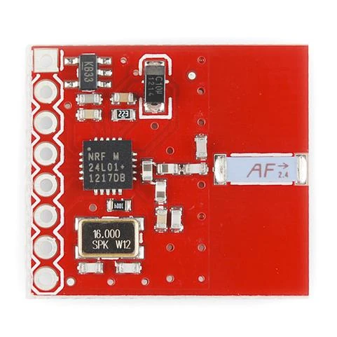
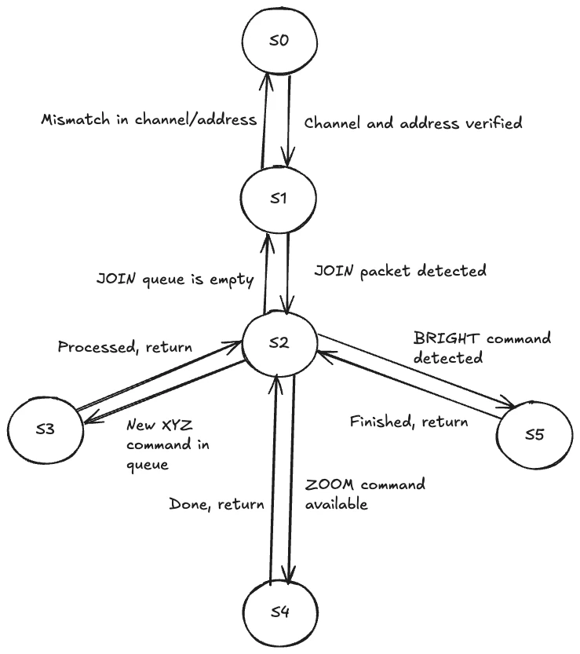
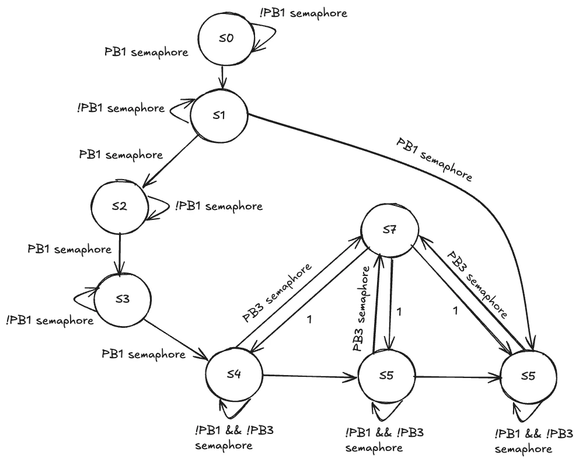
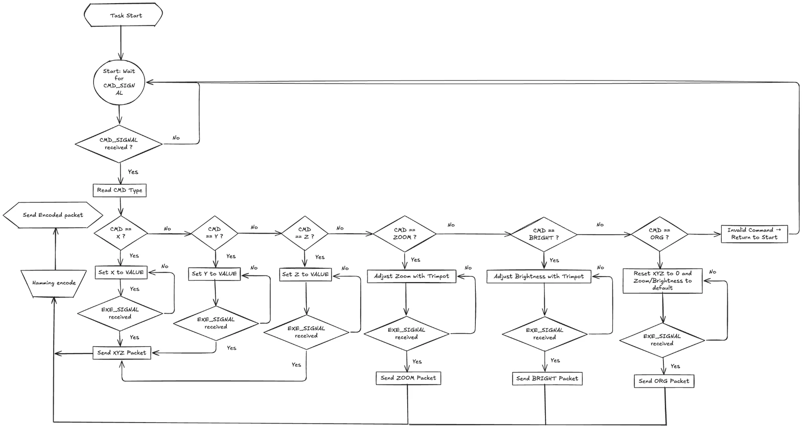
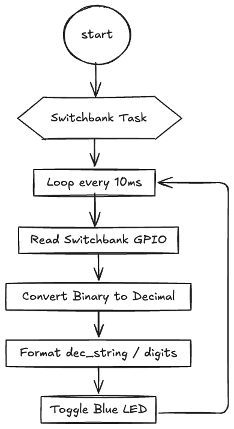
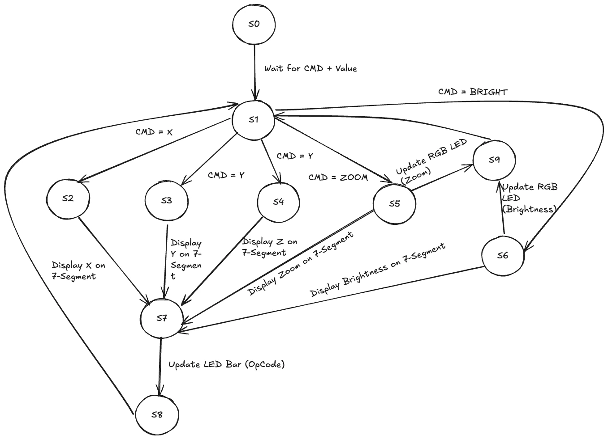
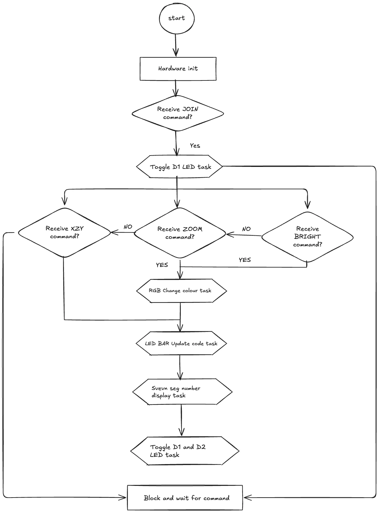

# Building a Wireless FreeRTOS Controller for a Remote Microscope

One of the projects that changed the way I think about embedded software was a **wireless controller for a Remote Controlled Microscope (RCM)**.

The physical system was much larger than the microcontroller sitting on my desk. The RCM was based on an X-Carve-style CNC platform, with stepper motors controlling the microscope position over a roughly 200 mm by 200 mm work area. The controller had to select commands locally, package them into a wireless protocol, send them through an nRF24L01+ radio link, and keep several local displays and indicators synchronized with the current command state.



*The RCM turns embedded commands into movement of a real three-axis physical system.*

The project used a Nucleo-F429ZI, an MFS board, an RGB LED, and an nRF24L01+ transceiver. What made the project interesting was not any one peripheral. It was the need to combine **FreeRTOS scheduling, finite-state machines, interrupt-driven inputs, wireless communication, packet encoding, and physical-system control** into one coherent architecture.

I came away from this project with a much stronger appreciation for one idea:

> In a larger embedded system, the hardest problem is usually not writing a driver. It is deciding which module is allowed to own which responsibility.

## The System Was a Chain of Responsibilities

At a high level, the controller had to turn physical input into a radio command.

The path was conceptually:

```text
Pushbuttons / switchbank / trimpot
        ↓
Command selection
        ↓
Command execution
        ↓
RCM state update
        ↓
Packet construction
        ↓
Hamming encoding
        ↓
TX queue
        ↓
nRF24L01+ radio
        ↓
Remote microscope
```

At the same time, the controller had local output responsibilities:

```text
current command
    ↓
7-segment display
LED bar opcode
RGB status
diagnostic LEDs
```

That meant the design was not a single loop anymore. It was a set of **cooperating state machines and FreeRTOS tasks**.



*My top-level flow separated startup, button events, command processing, packet construction, and radio transmission.*

## Lesson 1 - FreeRTOS Is Most Useful When It Defines Ownership

It is easy to think that the reason to use an RTOS is simply to "run several things at once."

That is only part of the benefit.

What I found more useful was that FreeRTOS encouraged me to decide which task owned each resource.

For example, the radio transmitter should be responsible for the radio.

The command-input module should not directly manipulate radio registers just because it knows that a packet needs to be sent.

Instead, the cleaner relationship is:

```text
command task
    ↓
RCM system logic
    ↓
TX queue
    ↓
radio task
```

This creates a boundary.

The command task knows **what** should happen.

The radio task knows **how** to transmit it.

That difference became increasingly important as the project grew.

If every task can directly call every peripheral, then adding an RTOS can actually make the architecture harder to understand. Concurrency without ownership just creates more possible interactions.

## Lesson 2 - Queues Are More Than Buffers

The TX queue was one of the most important architectural boundaries in the project.

A packet producer could construct a command without caring whether the radio was currently idle, configuring its channel, waiting for the nRF24L01+ state machine, or loading a transmit FIFO.

The producer only needed to place a valid packet into the queue.

The radio side could then process packets at its own pace.

That turns the queue into a contract:

```text
Producer guarantee:
"I will give you complete packets."

Consumer guarantee:
"I will transmit them in the correct radio context."
```

This is much easier to reason about than a design where command code immediately starts an SPI transaction.

It also makes failures easier to isolate.

If no packet appears on air, I can ask:

```text
Was the packet created?
Did it reach the queue?
Did the radio task dequeue it?
Did the nRF24L01+ enter TX mode?
```

Each question belongs to a different layer.

## Lesson 3 - The Radio Has Its Own State Machine

The nRF24L01+ is controlled through SPI and exposes control registers, TX/RX FIFOs, a CE control pin, and several radio states.



*The nRF24L01+ provides the wireless link while the MCU controls configuration and data transfer over SPI.*

The module operates at 2.4 GHz and supports data rates up to 2 Mbps. SPI is used both for configuration and for moving payload data into or out of the radio FIFOs.

This is important because "send packet" is not a primitive physical action.

The software has to coordinate:

```text
radio configuration
channel
address
FIFO state
CE control
TX state
return to idle
```

My radio-control FSM reflected that separation.



*The radio path verifies configuration, handles JOIN ownership, and then processes command packets through dedicated states.*

This project reinforced a useful rule for peripheral drivers:

> If the hardware itself is stateful, pretending that it is a stateless function call usually makes the software worse.

A finite-state machine makes the legal transitions explicit.

## Lesson 4 - JOIN Was Really an Ownership Protocol

Before normal control packets could be accepted, the controller had to send a `JOIN` packet.

At first, this looked like just another command.

It is more useful to think of it as a distributed ownership mechanism.

The rule is essentially:

```text
JOIN
  ↓
RCM associates control with this sender
  ↓
XYZ / ZOOM / BRIGHT commands become valid
```

Without a valid JOIN, the RCM rejects subsequent control packets.

This solves an important physical-system problem: multiple users should not independently move the same microscope at the same time.

That made the protocol feel much more real to me.

The packet is not only carrying data. It is establishing **permission to affect a physical machine**.

In a networked embedded system, protocol design and safety boundaries can become the same problem.

## Lesson 5 - Packet Structure Should Be Stable Before the Tasks Become Complicated

The project used a fixed radio packet structure with:

```text
packet type
sender address
payload string
padding
```

A raw packet was 16 bytes.

Each half-byte was then Hamming encoded, producing a 32-byte radio packet.

Conceptually:

```text
16-byte raw packet
       ↓
split each byte into two nibbles
       ↓
Hamming encode each nibble
       ↓
32-byte encoded packet
       ↓
TX queue
```

The major packet types included:

| Type | Purpose |
| --- | --- |
| `JOIN` | Acquire control of the RCM |
| `XYZ` | Set absolute X, Y and Z coordinates |
| `ZOOM` | Set/change microscope zoom |
| `BRIGHT` | Adjust image brightness |

For an XYZ packet, the coordinates are expressed as decimal ASCII fields. That makes the payload relatively easy to inspect during debugging.

I liked the separation between **semantic payload** and **radio representation**.

The command layer can think in terms of:

```text
X = 100 mm
Y = 0 mm
Z = 0 mm
```

while the packet layer is responsible for turning that meaning into the exact byte layout required on air.

That boundary is worth protecting.

## Lesson 6 - Error-Correcting Codes Change the Way You Think About Interfaces

Hamming encoding was another part that initially looked like a small implementation detail.

It became more interesting when I thought about where it belongs.

The command logic should not care that a nibble is being protected by an error-correcting code.

Similarly, the radio driver should not need to understand that the payload represents an X coordinate.

A cleaner stack is:

```text
RCM command
    ↓
raw protocol packet
    ↓
Hamming encoding
    ↓
radio transport
```

Each layer transforms the representation while preserving the meaning.

This same idea appears in much larger communication systems.

Once I started viewing it that way, embedded networking became less about "sending bytes" and more about **building a protocol stack, even if the stack is small**.

## Lesson 7 - Interrupts Should Wake Work, Not Become the Work

Pushbuttons are asynchronous.

The tempting approach is to detect a button interrupt and immediately perform the entire action inside the interrupt handler.

That becomes dangerous when the action eventually includes:

```text
state-machine updates
display changes
packet creation
Hamming encoding
queue operations
radio transmission
```

The better design is to let the interrupt communicate an event to a task.

My overall flow used FreeRTOS synchronization to move from a button event into task-level processing.



*Button events are translated into synchronization signals that drive the higher-level command state machine.*

This is one of the most important habits I took from the project.

An ISR should ideally answer:

> "What happened?"

and then wake the code that decides:

> "What should the system do about it?"

Those are different responsibilities.

Keeping that boundary clear improves latency, predictability, and maintainability.

## Lesson 8 - A Command FSM Makes a Small User Interface Predictable

The local user interface had only a few physical inputs:

- a command-selection pushbutton;
- an execute pushbutton;
- an 8-bit switchbank value;
- a trimpot for relative settings.

But those inputs could control several behaviours:

```text
X
Y
Z
ZOOM
BRIGHT
ORG
```

A state machine was a natural way to map repeated CMD presses into a selected operation.



*The command task separates selecting an operation from executing it and constructing the corresponding packet.*

This is much cleaner than writing a long list of unrelated button checks.

The state machine answers:

```text
What command is currently selected?
```

The execute event answers:

```text
When should the selected command take effect?
```

The switchbank or trimpot answers:

```text
What value should that command use?
```

Separating those three ideas reduced ambiguity.

## Lesson 9 - Input Conversion Deserves Its Own Task Boundary

The switchbank provided an 8-bit input value.

One of my task flows periodically read the GPIO state, converted the raw binary input to a decimal representation, formatted it for the rest of the system, and then returned to a periodic wait.



*The switchbank task turns raw GPIO state into a reusable numeric value rather than exposing pin-level details to command logic.*

This may look like a small wrapper around GPIO.

But it represents an important software boundary:

```text
hardware representation:
8 GPIO bits

application representation:
VALUE
```

The command FSM should care about `VALUE`, not individual pins.

That same principle scales to sensors, ADCs, network packets, and almost every embedded interface.

## Lesson 10 - Local Indicators Are Extremely Valuable in Distributed Debugging

A wireless physical system can fail in many places.

A command might be selected correctly but never executed.

A packet might be created correctly but never transmitted.

The radio might transmit but the RCM might reject the sender.

Without local observability, all of these failures can look like:

> "The microscope did not move."

The project therefore used several local indicators:

```text
MFS D1      -> packet transmission activity
MFS D2      -> pushbutton activity
LED bar     -> selected command opcode
7-segment   -> current command value
RGB LED     -> zoom/brightness direction or default state
```

My output FSM coordinated those displays.



*The local-output logic maps command state to the seven-segment display, LED bar, and RGB indicator.*

This made me appreciate diagnostic outputs as part of architecture rather than decoration.

A spare LED can sometimes save more debugging time than another hundred lines of logging code.

## Lesson 11 - Absolute Motion Commands Simplify the Distributed State

The RCM uses an absolute coordinate frame for X, Y, and Z.

The work area is approximately:

$$
200\text{ mm} \times 200\text{ mm}
$$

with an origin at the lower-left of the operating area.

A command such as:

```text
XYZ10000000
```

describes a target state rather than a movement history.

That has a useful property in a remote-control system.

With relative commands:

```text
move +10
move +10
move -5
```

the sender and receiver must remain synchronized about the current position.

With absolute commands:

```text
go to X = 100
```

the desired final state is explicit.

That does not eliminate every synchronization problem, but it reduces how much history has to be shared between the controller and the machine.

## The Architecture Became Easier to Understand as Several FSMs

By the end of the project, I was not thinking in terms of one giant state machine.

I had several smaller behavioural models:

```text
Command FSM
    -> what the user is selecting

Radio FSM
    -> how packets reach the air

Output FSM
    -> what local feedback should be shown

RCM processing flow
    -> how received command types affect the machine

FreeRTOS synchronization
    -> how events move between those modules
```

The receive-side flow also made the protocol layering visible.



*JOIN, XYZ, ZOOM, and BRIGHT commands follow different paths but eventually converge on shared output and waiting states.*

A single giant FSM would have created too many transitions.

Multiple smaller FSMs allowed each module to describe one domain.

This is a design pattern I still prefer:

> Use state machines to describe local behaviour, and use queues/events to connect the machines.

## What I Would Improve in a Second Version

If I rebuilt the controller now, I would keep the overall task separation but make several parts more explicit.

### 1. Add an application-level acknowledgement

The radio can indicate transport-level success, but for a physical system I would also like to know that the remote application accepted and applied the command.

Conceptually:

```text
command
    ↓
radio transmission
    ↓
remote validation
    ↓
ACK with command sequence number
```

That would make it easier to distinguish radio delivery from physical command acceptance.

### 2. Add sequence numbers

A sequence number would help detect:

```text
duplicates
stale packets
out-of-order application messages
```

especially if the protocol were expanded.

### 3. Centralise system state

I would keep one explicit RCM state model containing:

```text
X
Y
Z
zoom
brightness
ownership status
last command
```

and let display and packet-generation tasks consume snapshots or messages derived from it.

### 4. Make task interfaces more strongly typed

Instead of moving generic byte arrays between every layer, I would use small message structures internally and only serialize them at the packet boundary.

That would make invalid states harder to represent.

### 5. Instrument queue and task timing

For a FreeRTOS system, I would add lightweight runtime measurements for:

```text
queue depth
task execution time
radio service latency
command-to-transmit latency
stack high-water marks
```

This would make performance tuning much more quantitative.

## Final Thoughts

This project was a useful transition from peripheral-level embedded programming to **system-level embedded architecture**.

The nRF24L01+ driver mattered.

The FreeRTOS APIs mattered.

The Hamming encoder mattered.

But the deeper lessons were about how those pieces should be connected.

I learned to think more carefully about:

- task ownership;
- queues as module boundaries;
- interrupts as event sources;
- protocol layers;
- finite-state machines;
- synchronization primitives;
- diagnostic observability;
- the difference between raw hardware values and application-level state.

The physical microscope made those decisions feel much more consequential.

If a small LED demo has a race condition, an LED flashes incorrectly.

If a distributed controller has a confused state model, a physical machine may move somewhere the operator did not intend.

The biggest lesson I kept from the RCM project is:

> A reliable embedded system is built by controlling not only the hardware, but also the flow of responsibility between software components.

That idea has become one of the main ways I evaluate embedded architectures today.
