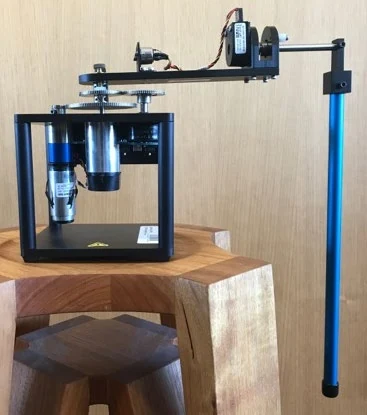
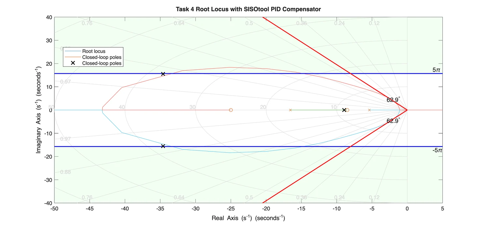
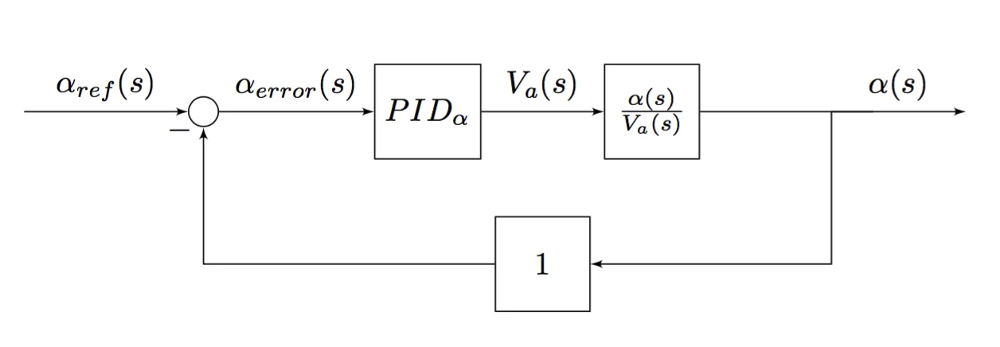
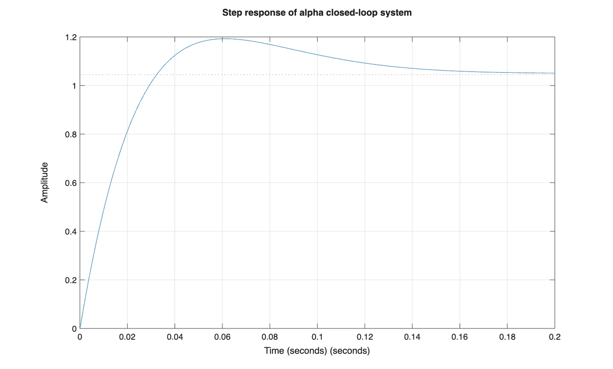
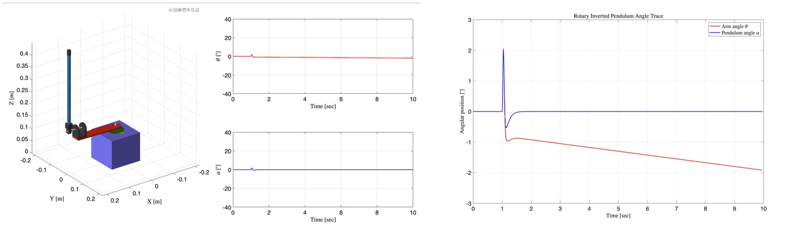
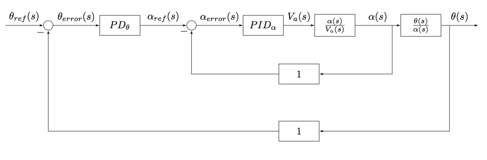
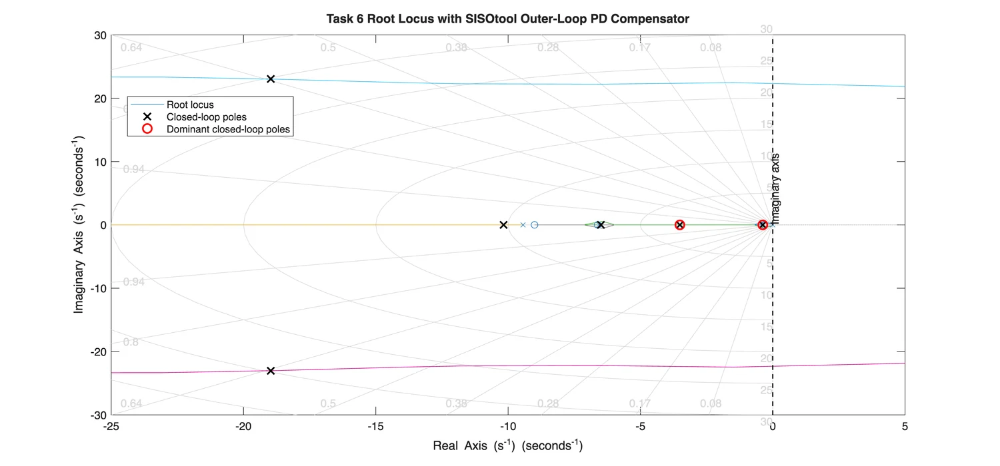
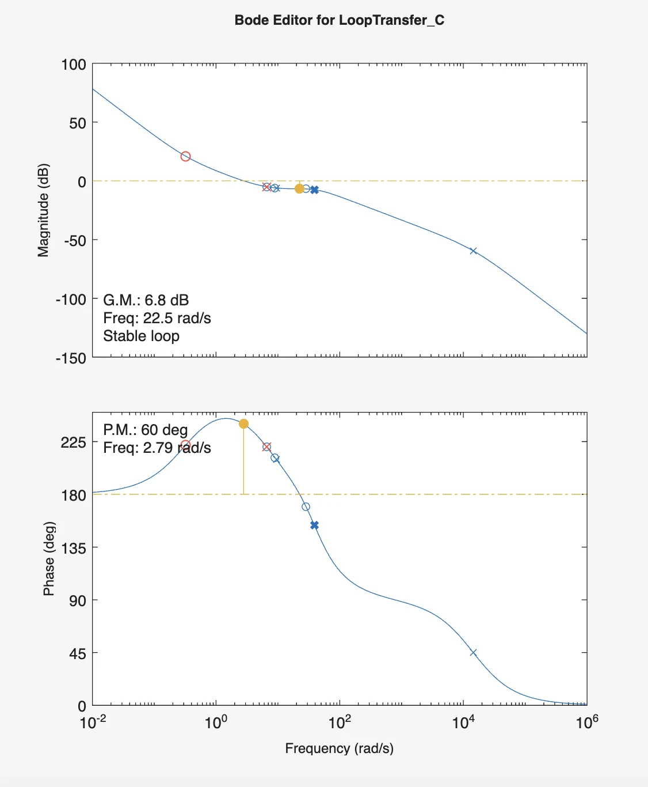
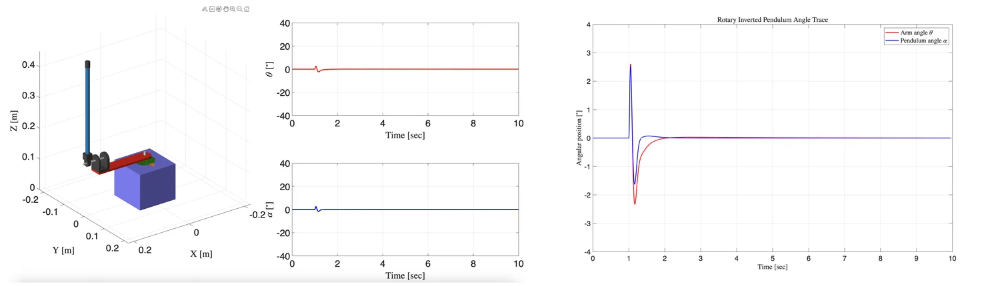
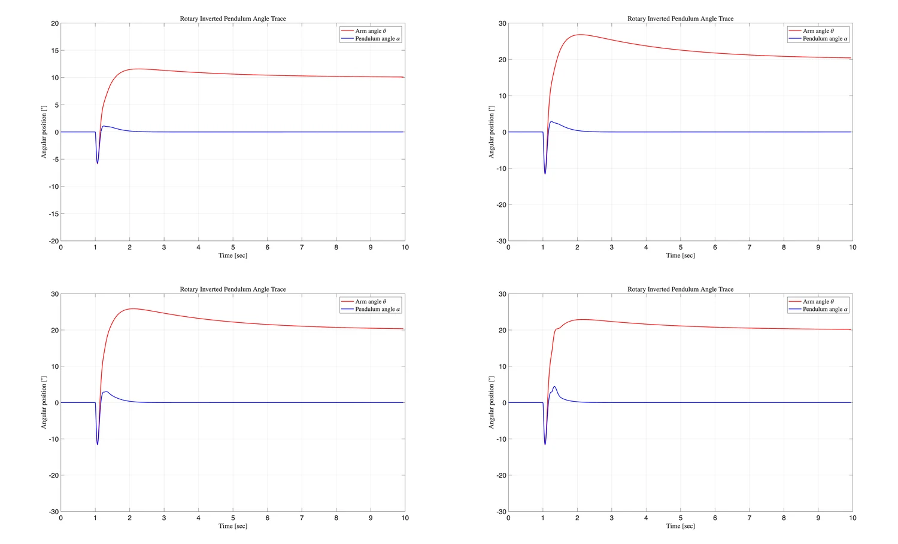

# Balancing a Furuta Pendulum: From Plant Modelling to Cascade Control

The inverted pendulum is one of those control problems that looks simple in a diagram and becomes much more interesting as soon as the model is connected to a real actuator.

In this project, I worked with a **Furuta-type rotary inverted pendulum**. A motor drives a horizontal arm through a gearbox, while a pendulum is attached at the end of the arm. The primary objective is to keep the pendulum upright:

$$
\alpha = 0
$$

but doing that alone is not enough. The rotary arm angle $\theta$ also has to remain controlled.

That second requirement became the most important lesson of the project.

A single-loop controller could recover the pendulum angle after a disturbance, yet the arm itself slowly drifted away. The system only behaved the way I actually wanted after I introduced a **cascade controller**: a fast inner loop for $\alpha$ and a slower outer loop for $\theta$.



*The Furuta pendulum couples a rotary arm and an inverted pendulum through one motor-driven mechanical system.*

This project gave me a practical way to connect several control concepts that can otherwise feel separate:

```text
mechanical modelling
    -> transfer functions
    -> root locus
    -> PID design
    -> nonlinear simulation
    -> cascade control
    -> disturbance rejection
```

## Start with the Mechanical Model

Before designing a controller, I first had to determine the effective rotational inertia seen at the arm axis.

The motor, tachometer, gears, encoder, potentiometer, and arm all contribute inertia, but the gear train reflects each inertia through the square of the gear ratio.

For a generic gear pair,

$$
J_{\text{reflected}}
=
\left(
\frac{N_{\text{output}}}{N_{\text{input}}}
\right)^2 J
$$

After referring the drivetrain components to the rotary axis and adding the arm inertia,

$$
J_{\text{arm}} = \frac{mr^2}{3}
$$

the total effective inertia in my model was approximately:

$$
J \approx 0.00608\ \text{kg}\cdot\text{m}^2
$$

This part of the project reminded me that controller design depends directly on mechanical assumptions.

A root locus can look perfect for the wrong plant.

So I now think of modelling error as something that should be treated with the same seriousness as tuning error.

## From Motor Voltage to Pendulum Motion

The plant contains both the pendulum mechanics and the motor electrical dynamics.

The motor torque depends on the applied voltage, armature resistance and inductance, motor constants, gearbox ratio, and back EMF.

The resulting model gave me two useful transfer functions:

```text
motor voltage Va
    -> pendulum angle alpha
    -> rotary arm angle theta
```

In MATLAB, I also rebuilt the transfer functions using `series`, `feedback`, and `minreal` to check the algebraic derivation.

That verification step was useful because complicated symbolic expressions are easy to get wrong.

The normalized pendulum-angle plant was approximately:

$$
\frac{\alpha(s)}{V_a(s)}
=
\frac{3.801\times10^5s}
{s^4+1.444\times10^4s^3+2.123\times10^5s^2-1.002\times10^6s-9.286\times10^6}
$$

The important part was not memorising the coefficients.

It was establishing one consistent plant model that could be used for:

- root-locus design;
- MATLAB verification;
- Simulink simulation;
- later cascade-control analysis.

## Lesson 1 - Translate Time-Domain Requirements into Pole Regions

The inner controller was designed to regulate the pendulum angle $\alpha$.

The required transient response was:

$$
T_p \leq 0.2\ \text{s}
$$

and

$$
\%OS \leq 20\%
$$

For a dominant second-order approximation,

$$
T_p = \frac{\pi}{\omega_d}
$$

so:

$$
\omega_d \geq 5\pi
$$

The overshoot requirement gives approximately:

$$
\zeta \geq 0.456
$$

Those two equations convert a time-domain specification into an allowed region of the $s$-plane.

That was the part of root locus that became much more meaningful to me during this project.

Instead of asking:

> "Where should I put the poles?"

I could ask:

> "Which pole locations correspond to the response I actually want?"



*The root-locus design region was defined by the peak-time and damping-ratio requirements.*

## Lesson 2 - PID Design Is Easier to Understand as Pole-Zero Shaping

The inner loop used a PID compensator:

$$
PID_\alpha(s)
=
K_{P,\alpha}
+
K_{D,\alpha}s
+
\frac{K_{I,\alpha}}{s}
$$

I selected two real zeros and an integrator.

The final compensator was:

$$
PID_\alpha(s)
=
2.4\frac{(s+25)(s+8.5)}{s}
$$

which gives:

$$
K_{D,\alpha}=2.4
$$

$$
K_{P,\alpha}=80.4
$$

$$
K_{I,\alpha}=510
$$



*The inner loop uses the pendulum-angle error to generate the motor-voltage command.*

I found it more useful to think of this controller as a **pole-zero shaping device** than as three independent gains.

The integrator changes the low-frequency structure.

The two zeros reshape the root locus.

The overall gain then selects the closed-loop pole locations.

That viewpoint made the tuning process much less arbitrary.

## The Linear Controller Met the Original Specification

The closed-loop step response gave:

$$
T_p = 0.0619\ \text{s}
$$

and

$$
\%OS = 14.1389\%
$$

Both values satisfy the original requirements.



*The designed inner PID loop meets the peak-time and overshoot requirements in the linear model.*

At this stage, it would be tempting to say that the controller design was finished.

The nonlinear simulation showed why that conclusion would have been premature.

## Lesson 3 - Stabilising the Pendulum Is Not the Same as Controlling the System

I implemented the PID controller in the nonlinear Simulink plant and applied a short voltage disturbance:

$$
V_d(t)=u(t-1)-u(t-1.025)
$$

The pendulum angle behaved well.

After the disturbance, $\alpha$ returned close to zero.

But the arm angle $\theta$ did not.



*The inner PID loop recovers the pendulum angle, but the rotary arm position continues to drift because theta is not directly regulated.*

This result was one of the most useful parts of the project.

The controller was doing exactly what I had asked it to do.

It was minimising:

$$
e_\alpha(t)=\alpha_{\text{ref}}(t)-\alpha(t)
$$

with:

$$
\alpha_{\text{ref}}=0
$$

There was no term in that loop asking the arm to return to its original position.

So when the arm moved to recover the pendulum, nothing forced $\theta$ back to zero.

This is a very general control lesson:

> A controller cannot regulate a variable that never appears in its feedback objective.

The problem was not that the inner PID was badly tuned.

The problem was that the control architecture was incomplete.

## Lesson 4 - Cascade Control Solves a Structural Problem

The solution was to add a second loop.

The inner loop remains responsible for keeping the pendulum upright.

The outer loop regulates the rotary arm angle.


The important requirement is that the inner loop should be faster than the outer loop.

The outer controller assumes that when it requests a small change in $\alpha_{\text{ref}}$, the inner controller can realise that request quickly enough.



*The outer theta loop generates the reference for the faster inner alpha loop.*

This gave me a more practical understanding of hierarchical control.

The two loops do not have equal responsibilities.

The inner loop handles the fast unstable pendulum dynamics.

The outer loop handles the slower arm-position objective.

## Lesson 5 - The Outer Controller Should Respect the Inner-Loop Dynamics

For the outer loop, I used a PD compensator with a first-order derivative filter.

The tuned controller was approximately:

$$
PD_\theta(s)
\approx
-0.01735
\frac{1+3.1s}{1+0.15s}
$$

An equivalent Simulink PID-block representation was:

$$
P_\theta=-0.01735
$$

$$
D_\theta=-0.05074
$$

$$
N_\theta=6.57
$$

The selected zero and pole were approximately:

$$
z=-0.325
$$

$$
p=-6.57
$$



*The compensated outer-loop poles remain in the left-half plane, with the slowest pole dominating the arm response.*

The dominant closed-loop pole was approximately:

$$
s_1=-0.378
$$

while the remaining poles were further into the left-half plane.

That is exactly what I wanted from the cascade architecture: a visibly slower outer loop wrapped around a faster inner loop.

## Lesson 6 - Stability Margins Are More Informative Than a Stable Pole Plot Alone

I also checked the compensated outer loop in the frequency domain.

The resulting margins were approximately:

$$
GM = 6.8\ \text{dB}
$$

and

$$
PM = 60^\circ
$$



*The outer-loop controller retains useful gain and phase margins after compensation.*

The poles tell me whether the nominal model is stable.

The gain and phase margins give another view of how much uncertainty or additional phase lag the loop can tolerate before losing stability.

That distinction became more important to me once the controller moved from a transfer-function diagram into a nonlinear simulation.

## Lesson 7 - Non-Minimum-Phase Behaviour Can Look Wrong Even When It Is Correct

The outer-loop step response initially moved in the **opposite direction** from the commanded arm motion.

Then it reversed and moved toward the reference.



*The cascade controller keeps both angles bounded and removes the long-term arm drift seen with the single-loop controller.*

My first instinct when seeing an inverse response like this is to suspect a sign error.

In this case, the behaviour was expected from the non-minimum-phase nature of the inverted-pendulum system.

This is an important debugging habit:

> An unintuitive transient is not automatically an implementation bug.

Before changing gains or signs, check whether the plant itself contains zeros or coupled dynamics that predict the behaviour.

## Lesson 8 - A Good Inner Loop Makes the Outer Loop Possible

In the nonlinear cascade simulation, both variables remained bounded.

The pendulum angle $\alpha$ moved during the transient and then returned close to zero.

The rotary arm angle $\theta$ also returned to the intended value instead of continuing to drift.

This is what the single-loop controller could not achieve.

Conceptually:

```text
Inner loop:
keep alpha near zero

Outer loop:
choose alpha_ref so theta goes where we want
```

That is the key idea behind the architecture.

The outer loop does not directly command motor voltage.

It requests a pendulum-angle behaviour from the inner loop.

That separation of objectives is what makes the cascade structure work.

## Lesson 9 - Test More Than One Reference and More Than One Disturbance

I tested the nonlinear cascade controller with several cases:

```text
10 degree theta reference, no disturbance
20 degree theta reference, no disturbance
20 degree theta reference, 0.5 V disturbance
20 degree theta reference, 2 V disturbance
```



*The same cascade controller was tested with different reference magnitudes and disturbance levels.*

The 10-degree and 20-degree cases both showed the expected initial inverse response before $\theta$ moved toward the command.

For the disturbance tests, the voltage disturbance was applied at:

$$
t=1.25\ \text{s}
$$

The 0.5 V case produced a relatively small additional transient.

The 2 V case produced a more aggressive response, especially in $\alpha$, but both angles remained bounded and recovered.

This is a much stronger validation than showing only one clean nominal step response.

A controller that performs well on one operating point may still be fragile.

Even simple variation in reference magnitude and disturbance size can reveal a lot.

## What I Would Change in a Second Version

### 1. Separate model validation from controller tuning

I would first validate the plant model against experimental data before spending too much time refining the compensator.

A precise controller for an inaccurate plant is not necessarily useful.

### 2. Add actuator saturation explicitly

The linear design assumes the requested motor voltage is available.

A practical implementation should include:

```text
voltage saturation
rate limits
anti-windup
```

especially because the inner loop contains integral action.

### 3. Quantify the cascade bandwidth separation

Instead of only reasoning qualitatively that the inner loop is faster, I would compare closed-loop bandwidths directly.

A practical target could be expressed as:

$$
\omega_{\text{BW,inner}}
\gg
\omega_{\text{BW,outer}}
$$

### 4. Compare linear and nonlinear responses systematically

The nonlinear model exposed behaviour that the simple linear step response did not.

I would automate comparison across:

```text
linear model
nonlinear model
different disturbances
different references
parameter perturbations
```

### 5. Move toward state-space control

For a coupled system such as the Furuta pendulum, a state-space design would be a natural next step.

It would allow the arm and pendulum states to be handled inside one multivariable framework instead of coordinating two SISO loops.

The cascade design is very useful for understanding the system, but it also makes the coupling visible enough to motivate more advanced control methods.

## Final Thoughts

The most important lesson from this project was not how to tune a PID controller.

It was learning that **control performance depends on choosing the correct architecture before choosing the gains**.

The inner PID controller was successful by its own specification:

- it met the peak-time requirement;
- it met the overshoot requirement;
- it recovered the pendulum after a disturbance.

And yet the complete system still had an undesirable behaviour: the rotary arm drifted.

The cascade controller solved that because it added the missing control objective.

That changed the way I think about feedback design.

I now ask these questions before tuning:

- Which variables actually need regulation?
- Which dynamics are fast and which are slow?
- What should each loop be responsible for?
- Does every important variable appear somewhere in the feedback architecture?
- Is an unexpected transient caused by the controller, or by the plant itself?

The project started as a PID and root-locus exercise.

For me, it ended as a lesson in **system-level control architecture**:

> A well-tuned controller can still solve the wrong problem. Good control design starts by deciding what the complete system must regulate.
