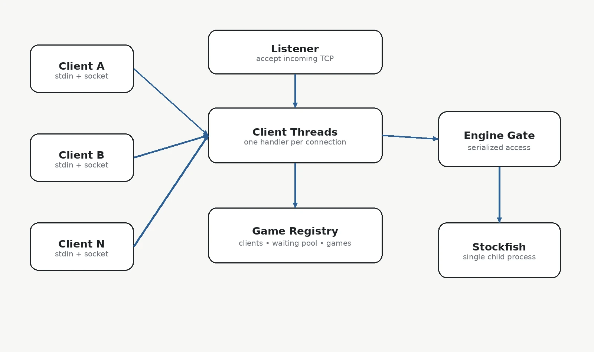
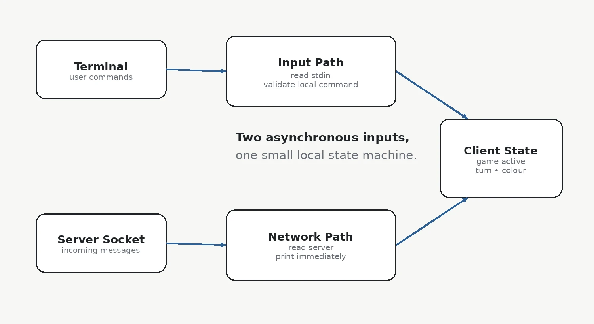
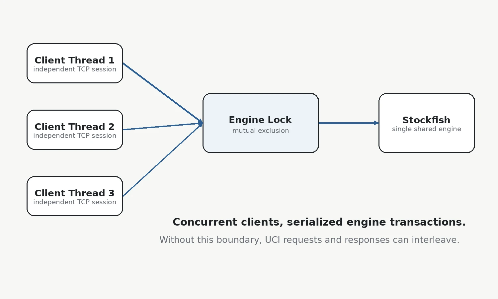
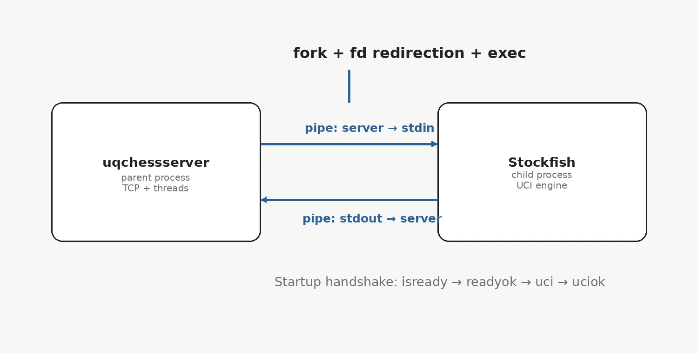
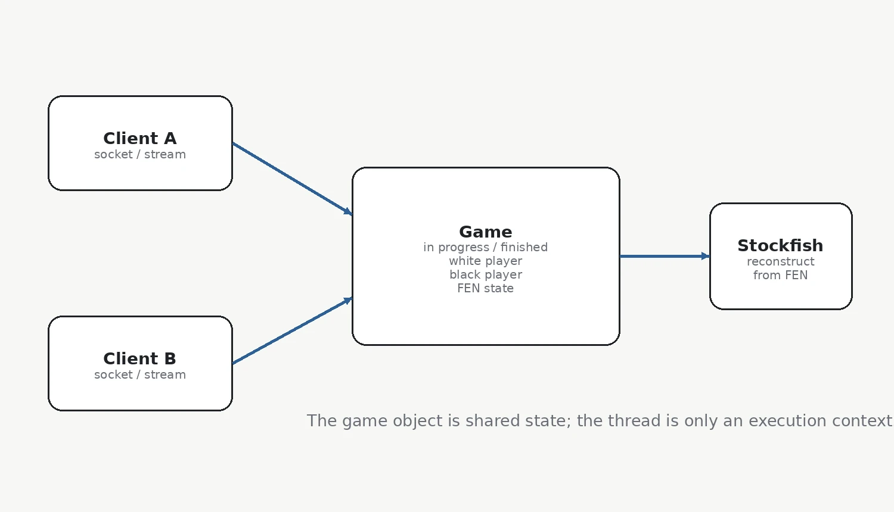
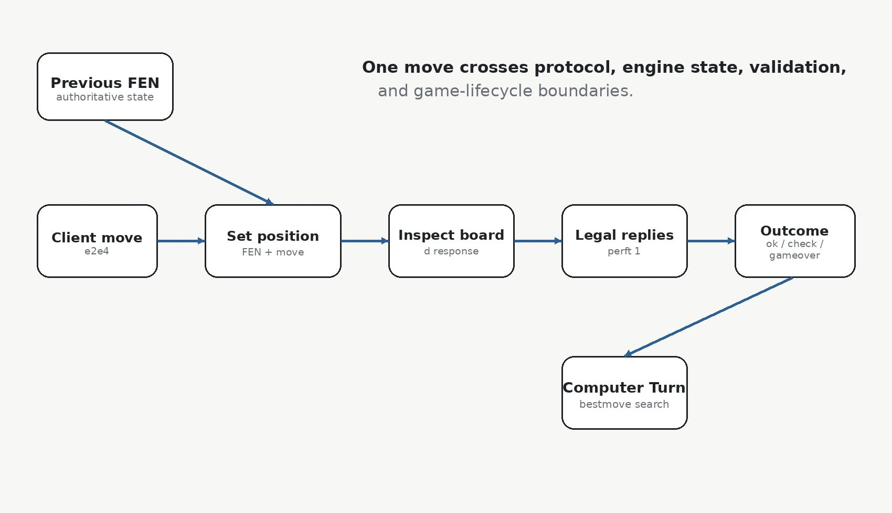
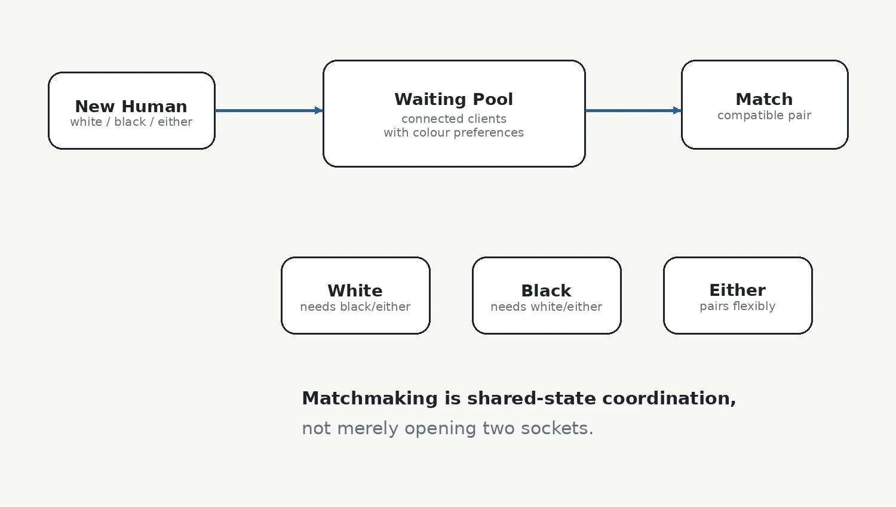
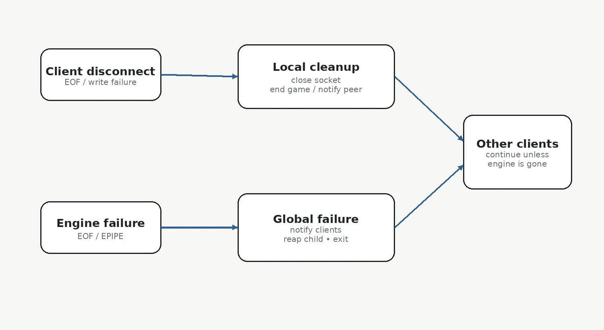

# Building a Multithreaded Chess Server in C: TCP, Threads, Pipes, and Stockfish

A chess server is a surprisingly good systems-programming project.

At first glance, the application sounds simple:

```text
connect a client
receive a move
check the move
send a response
```

The interesting part appears when the requirements become more realistic.

Several clients may be connected at the same time. Some want to play the computer, while others want to be paired with another human. The chess engine is a separate process. Network communication is asynchronous. A human opponent can disconnect halfway through a game. The server has to retain game state, serialize access to shared resources, and continue running even when one connection disappears.

That turns a chess application into a compact exercise in:

```text
TCP networking
POSIX threads
process creation
pipes and file descriptors
inter-process communication
mutual exclusion
protocol parsing
shared state
failure handling
```

The main lesson I took from this project was not about chess.

It was about **where state should live when several independently executing parts of a program need to cooperate**.



*Multiple TCP sessions are handled concurrently, while game state and the single chess-engine process are shared resources.*

## The Architecture Has Three Different Kinds of Concurrency

I found it useful to separate the problem into three concurrency domains.

### 1. Client-side asynchrony

The client has two independent input sources:

```text
stdin
network socket
```

A user may type a command while a server message is arriving.

### 2. Server-side client concurrency

Every connected client has an independent network session.

The server therefore needs to make progress on many sockets at the same time.

### 3. Process-level concurrency

The chess engine is not a library call.

Stockfish is a separate process with its own stdin and stdout, connected to the server with pipes.

These look similar because all three involve "multiple things happening", but they require different abstractions.

That distinction helped me avoid treating every problem as simply another thread.

## Lesson 1 - A Network Client Has to Listen in Two Directions

A blocking command-line client is easy to imagine:

```text
read user input
send request
wait for reply
repeat
```

That model assumes every message from the server is a direct reply to the most recent request.

A multiplayer game breaks that assumption.

If another human player makes a move, the server can send a message even though the local user did not just type anything. A game can also end because the other player resigns or disconnects.

So the client really has two independent flows.



One path reads commands from `stdin`.

The other continuously reads messages from the TCP connection.

The client itself should remain relatively thin. It does not need to understand the whole board. It only needs enough local state to decide whether commands such as `move`, `hint`, or `resign` are currently meaningful.

For example:

```text
game in progress?
my turn?
my colour?
```

The authoritative chess position belongs on the server side.

This gave me a useful distributed-systems rule:

> A client should store only the state it needs to provide its interface. The authoritative state should live where decisions are validated.

## Lesson 2 - Text Protocols Are Excellent for Debugging

The client and server communicate over TCP using a line-oriented text protocol.

Typical messages can be thought of as:

```text
start computer white
start human either
move e2e4
hint best
hint all
board
resign
```

and responses as:

```text
started white
ok
moved e7e5
check
moves ...
gameover ...
```

For a student project, a text protocol has a major advantage: it is observable.

I can connect with a simple terminal tool and manually send commands.

That lets me test the server independently from my own client implementation.

This is an underrated design property.

When both sides of a protocol are being developed at the same time, a human-readable wire format makes it much easier to answer:

> Is the problem in the client, the server, or the protocol?

Binary protocols may be more compact, but debuggability has real engineering value.

## Lesson 3 - One Thread Per Client Is Simple Until State Becomes Shared

The server accepts incoming TCP connections and creates one handler thread for each client.

That is conceptually straightforward:

```text
accept connection
    ↓
spawn handler thread
    ↓
read command
process command
send response
repeat
```

The difficulty appears when threads stop being independent.

Two client threads may refer to the same human-vs-human game.

Many client threads may need the same Stockfish process.

Several threads may access the waiting-player list.

At that point, the important question is no longer:

> How many threads do I have?

It becomes:

> Which data can be touched by more than one thread?



Every shared object needs a clearly defined synchronization policy.

A large mutex around everything may be correct but unnecessarily restrictive.

No mutex at all may work in simple tests and fail unpredictably under simultaneous connections.

The architecture gets much easier to reason about when shared resources are listed explicitly:

```text
connected-client registry
human-matchmaking pool
shared Game objects
Stockfish stdin/stdout transaction
```

## Lesson 4 - A Single Chess Engine Becomes a Serialized Service

One of the most interesting constraints was that the server uses **one Stockfish process** even while supporting multiple clients and games.

That means the engine cannot safely be treated as if every client thread owns its own private chess library.

Suppose two threads do this at the same time:

```text
Thread A:
position <game A>
go ...

Thread B:
position <game B>
go ...
```

If those command sequences interleave, the response no longer has an unambiguous owner.

The engine interaction therefore has to be treated as a transaction:

```text
lock engine
set game context
send UCI command
read complete response
unlock engine
```

The engine lock is not merely protecting a file descriptor.

It protects the **semantic integrity of a request-response conversation**.

That distinction matters.

Many concurrency bugs happen because programmers lock individual writes but forget that a protocol operation consists of several ordered writes and reads.

## Lesson 5 - Pipes Turn a Program into a Service

Stockfish runs as a child process.

The server creates two pipes:

```text
server -> Stockfish stdin
Stockfish stdout -> server
```

then forks, redirects file descriptors in the child, and launches the engine.



The startup sequence also has a small protocol of its own.

Conceptually:

```text
start process
    ↓
isready
    ↓
readyok
    ↓
uci
    ↓
uciok
```

This was one of the parts of the project I liked most because it connects several Unix concepts that can otherwise feel unrelated:

```text
pipe()
fork()
dup / descriptor redirection
exec()
FILE* or descriptor I/O
process lifecycle
```

The result is effectively a local service boundary.

Stockfish could have been a library, but using a process gives useful isolation:

- the engine has its own address space;
- it can be replaced independently;
- communication is constrained to a documented protocol;
- engine termination can be detected through the pipe.

## Lesson 6 - FEN Is a Better Game-State Boundary Than a Thread

A common mistake in threaded applications is to associate state too strongly with the thread currently executing.

A thread is only an execution context.

The chess game itself has a longer lifetime.

A useful game object needs to know things such as:

```text
in progress or finished
white player
black player
current / final board state
whose turn is next
```

The board state can be represented using **FEN (Forsyth-Edwards Notation)**.



This creates a useful separation:

```text
Client
    = communication endpoint

Thread
    = code currently handling the endpoint

Game
    = shared application state

FEN
    = serializable chess position
```

For a human-vs-human game, two client threads can point at the same `Game`.

Neither thread *is* the game.

That lesson generalizes well beyond chess.

> In concurrent servers, long-lived domain state should usually be represented explicitly rather than hidden inside thread-local control flow.

## Lesson 7 - The Engine Can Be Reconstructed from State

Because the server stores the board as FEN, the single Stockfish instance can be switched between games.

Before asking the engine a question, the server can reconstruct the relevant position:

```text
position fen <current FEN>
```

and then issue a query.

This is what makes sharing one engine practical.

The engine is not trusted as the only copy of the application state.

Instead:

```text
server game state
      ↓
reconstruct Stockfish context
      ↓
ask question
      ↓
parse response
      ↓
update server game state
```

That architecture is much safer than allowing the child process to become an undocumented global state store.

It also resembles how stateless backend services are designed: send enough context with each transaction that the service can answer correctly.

## Lesson 8 - Move Validation Is a Pipeline, Not a Boolean Function

A move such as:

```text
e2e4
```

looks like it should produce:

```text
valid / invalid
```

But the full server operation is richer.



A useful conceptual sequence is:

```text
1. load the current FEN
2. apply the proposed move in the engine context
3. inspect the resulting board
4. determine whether the state changed
5. count legal replies
6. determine check / checkmate / stalemate
7. if playing the computer, request its best response
8. update FEN
9. notify the relevant client or clients
```

The UCI interface gives several tools for different parts of that process.

### `position`

Defines the board state and optionally applies a candidate move.

### `d`

Returns diagnostic board information, including state that can be used to recover the current FEN and detect check conditions.

### `go perft 1`

Enumerates legal moves from the current position.

The number of legal replies matters when distinguishing:

```text
check
checkmate
stalemate
```

### `go movetime ... depth ...`

Searches for a best move, which can be used for hints or the computer opponent.

This part taught me that "validation" in a real application often crosses several subsystems.

It is not necessarily one function call.

## Lesson 9 - Matchmaking Is a Shared-State Problem

Computer games are comparatively easy because one client owns one game.

Human matchmaking introduces a waiting pool.

A player can request:

```text
white
black
either
```

The server has to find a compatible waiting client and create one shared game.



This means matchmaking requires a data structure that exists outside any single client thread.

Conceptually:

```text
Client A asks for white
    ↓
search waiting pool
    ↓
compatible black/either player?
    ↓
yes -> create game and notify both
no  -> record Client A as waiting
```

The subtle part is that another client thread may modify the same pool at the same time.

So matchmaking is simultaneously:

```text
application logic
+
concurrency control
```

I found this to be a good example of why race conditions are often really **domain-state races**, not just low-level memory races.

## Lesson 10 - Disconnects Are Part of the Game Protocol

A socket closing is a transport event.

In a multiplayer game, it also has application meaning.

If one human player disconnects during a game, the other player needs to be told that the game is over.

So cleanup is not simply:

```c
close(fd);
return;
```

The server may need to:

```text
mark the game finished
notify the opponent
remove the client from matchmaking
release client resources
close the socket
terminate only that handler thread
```



This is another systems lesson that I found useful:

> Resource cleanup and application-state cleanup are not always the same thing.

Closing the file descriptor handles the operating-system resource.

It does not automatically repair the application state that referenced that connection.

## Lesson 11 - SIGPIPE Is a Networking Design Issue, Not an Edge Case

Writing to a closed pipe or socket can generate `SIGPIPE`.

If the default action is allowed to terminate the process, one disconnected client could accidentally kill the whole server.

Similarly, failure of the Stockfish pipe means something very different from failure of one client connection.

The failure policy should reflect the ownership boundary:

```text
client socket failure
    -> terminate one client session
    -> server continues

Stockfish process failure
    -> shared engine unavailable
    -> all games lose engine service
    -> notify clients and terminate server
```

This is a clean example of **failure domains**.

The scope of recovery should match the scope of the failed resource.

## Lesson 12 - Blocking Is Good When There Is Nothing to Do

Concurrent programs sometimes become complicated because developers try too hard to make everything continuously active.

A server thread waiting for work should often simply block.

Examples include:

```text
accept()
read()
fgets()
getline()
```

A blocked thread consumes almost no CPU while waiting for an event.

The bad alternative is:

```text
check socket
nothing there
check again
check again
sleep a little
check again
```

Busy waiting adds latency, wastes CPU, and makes the server harder to reason about.

This project reinforced an important Unix programming habit:

> If progress depends on external input, block on the object that will deliver that input.

## A Data Model I Would Use

If I were structuring the project again, I would make the major domain objects explicit.

### Client

```text
socket / FILE streams
selected game mode
requested colour
current Game pointer
connection state
```

### Game

```text
white client or computer
black client or computer
FEN
in-progress flag
finished state
```

### Server

```text
listener
client collection
waiting-player collection
engine connection
engine mutex
shared-state mutexes
```

### Engine

```text
child PID
write stream
read stream
transaction lock
```

The exact C structures can vary.

What matters is that ownership is visible from the model.

## The Architecture I Would Prefer Today

I would still keep the overall thread-per-client model because it matches the scale of the problem well.

But I would make a few design rules explicit.

### Keep socket parsing outside game logic

A function that updates a chess game should not also be responsible for splitting TCP lines.

### Keep UCI parsing behind an engine API

The rest of the server should ask questions such as:

```text
is this move valid?
what is the resulting FEN?
what are the legal moves?
what is the best move?
is the side in check?
```

rather than manually scanning Stockfish output everywhere.

### Keep matchmaking operations atomic

Search + remove + create-game should be one protected state transition.

### Keep lock scope understandable

The engine lock may need to cover a complete UCI transaction.

A game-state lock should not be held while waiting unnecessarily on slow I/O unless the consistency requirement demands it.

### Treat messages to human opponents as cross-thread communication

One client handler may need to send a notification to another client's socket.

That should be an intentional capability of the data model, not an accidental global variable.

## What I Would Improve in a Second Version

### 1. Add a dedicated engine worker thread

Instead of allowing client threads to directly acquire the Stockfish lock, I would consider giving the engine its own request queue.

The architecture becomes:

```text
client threads
    ↓
engine-request queue
    ↓
single engine worker
    ↓
Stockfish
```

This serializes access naturally and makes the engine an active service rather than a locked resource.

### 2. Use typed internal requests

The network protocol is text.

The internal server representation does not need to be.

I would parse incoming messages immediately into structured requests such as:

```text
START_GAME
BOARD_REQUEST
HINT_BEST
HINT_ALL
MOVE
RESIGN
```

That reduces repeated string handling inside domain logic.

### 3. Centralize game transitions

I would place all game lifecycle changes behind a small API:

```text
game_start()
game_apply_move()
game_resign()
game_disconnect()
game_finish()
```

That makes it harder for two different request handlers to update state inconsistently.

### 4. Add stronger runtime instrumentation

I would measure:

```text
connected clients
waiting players
active games
engine request latency
commands per client
lock wait time
```

Concurrency problems are much easier to diagnose when the program can explain what it is doing.

### 5. Test the server independently from the official client

Because the protocol is text based, I would use scripted raw TCP tests for:

```text
malformed commands
rapid reconnects
two clients moving at nearly the same time
disconnect during a game
engine failure
human colour matching
```

That kind of testing is more effective than relying only on manual gameplay.

## Final Thoughts

This project looked like a chess application, but most of the difficult reasoning had nothing to do with chess strategy.

The real questions were:

- Who owns the board state?
- How do several client threads share one engine?
- How should two human clients be paired?
- What must be protected by synchronization?
- Which failures affect one session and which affect the whole service?
- How do I preserve state when the executing thread changes?
- Where should protocol parsing stop and domain logic begin?

Those questions appear in many real systems.

A database server, build service, multiplayer game, hardware-control daemon, or model-serving backend can all have the same underlying shape:

```text
many clients
    ↓
concurrent request handling
    ↓
shared domain state
    ↓
serialized access to a limited resource
```

The most useful lesson I kept from the project is:

> Concurrency becomes manageable when state ownership is explicit and communication boundaries are designed before the threads are added.

The threads themselves are not the architecture.

The architecture is the set of rules that determines how those threads are allowed to interact.
