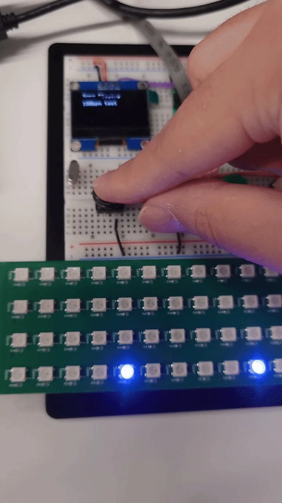
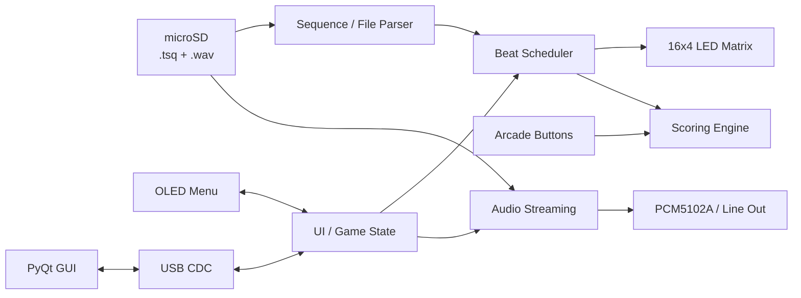
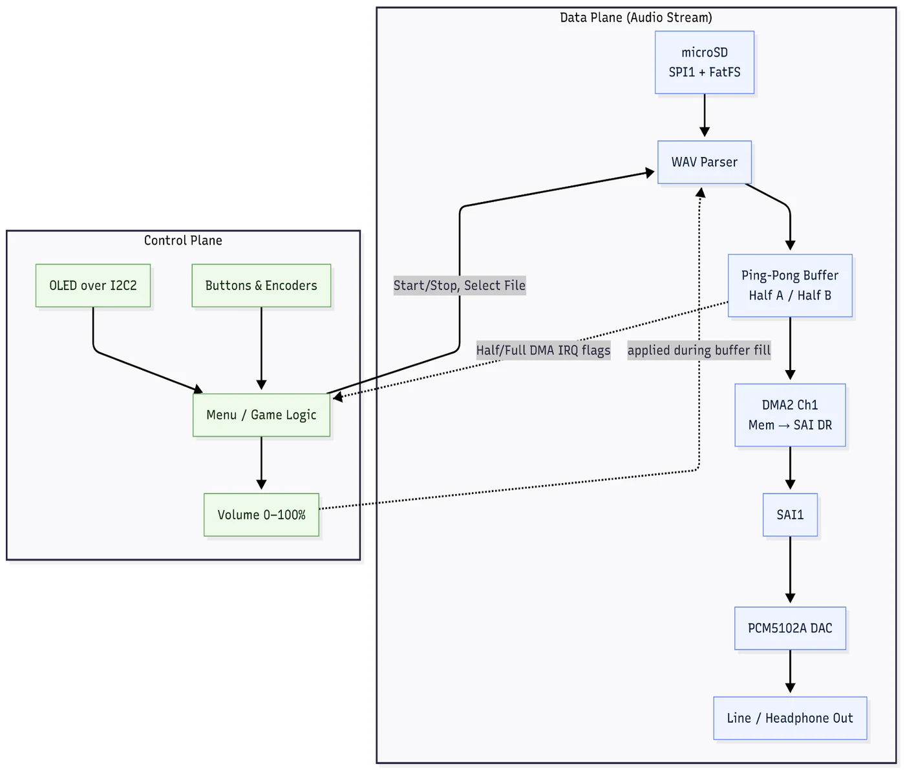
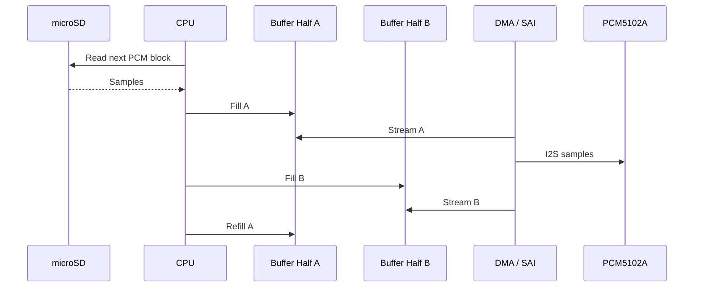
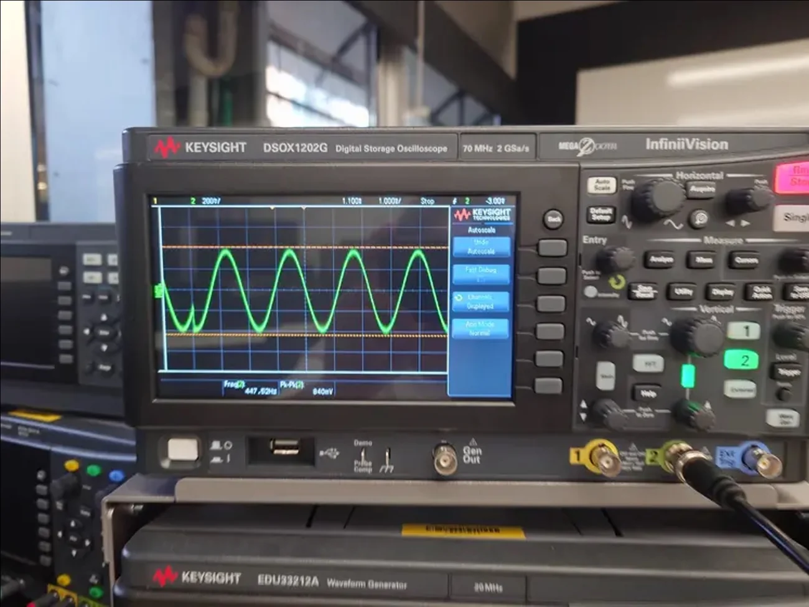
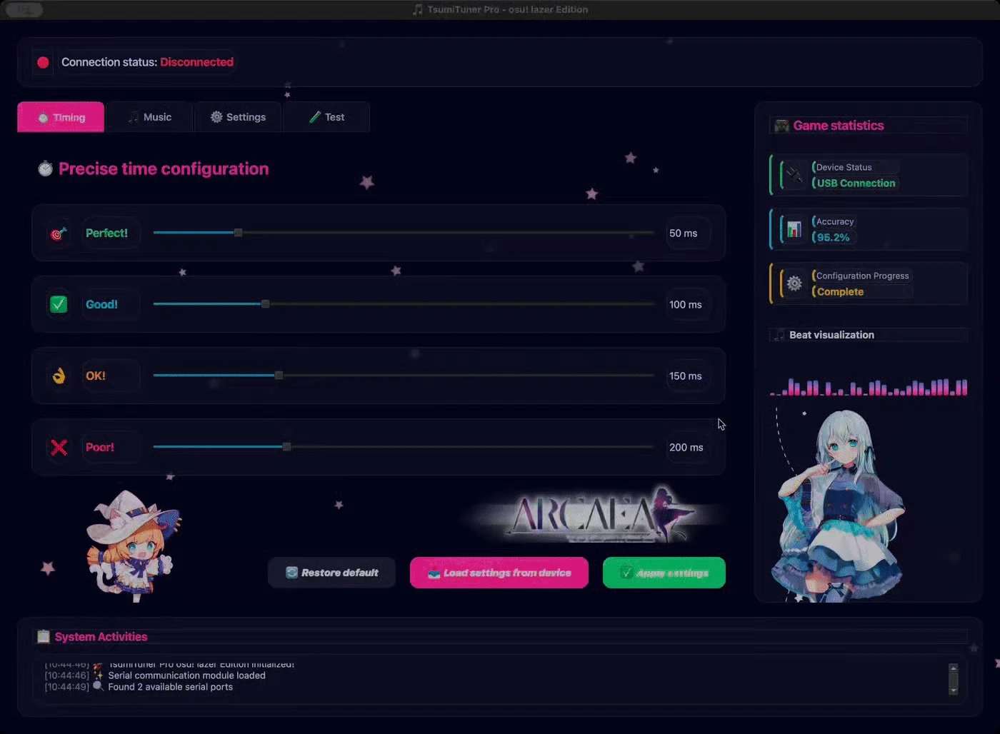
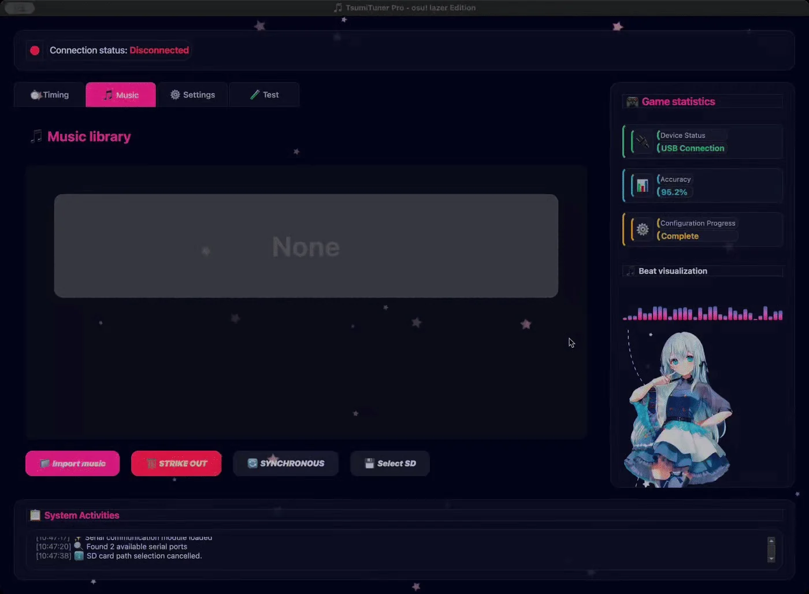
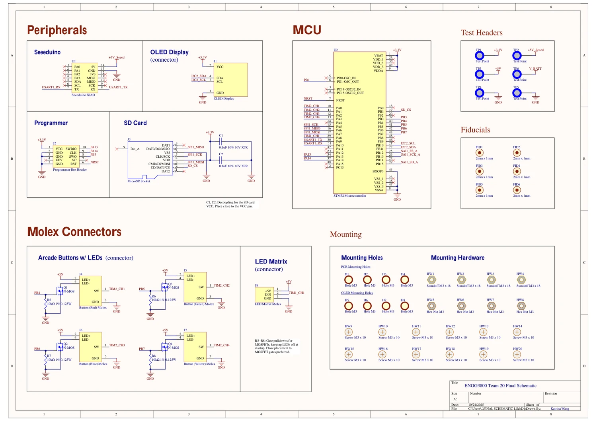
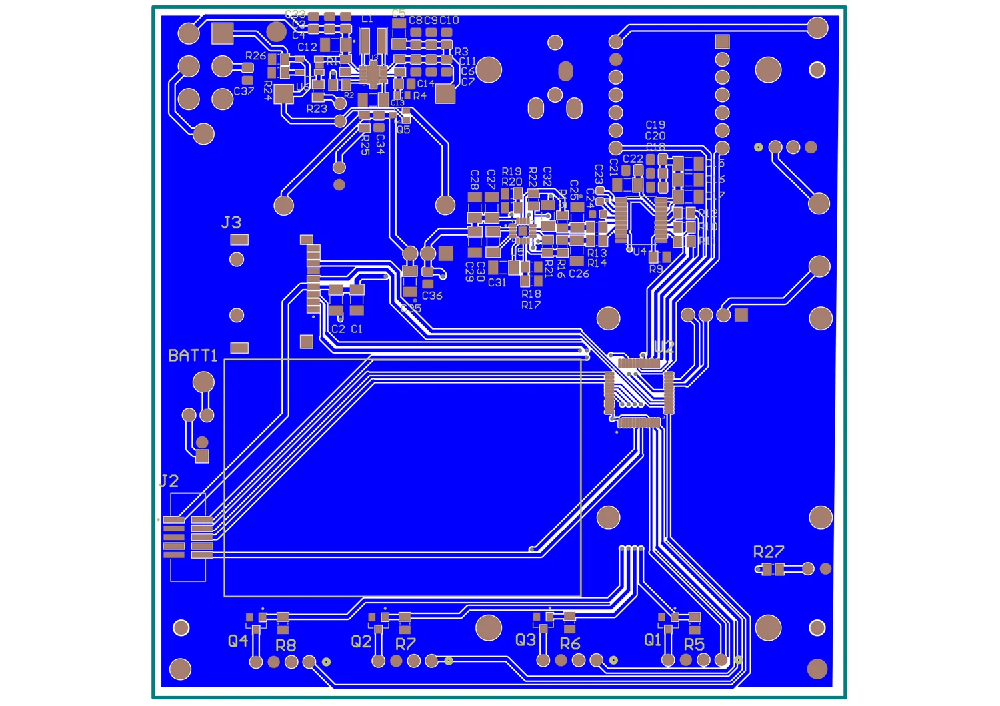

# Building a Real-Time Rhythm Game on STM32: Timing, DMA, LEDs, and GUI Integration

A rhythm game is a surprisingly good real-time systems project.

On the surface, the idea is simple: play a song, light up the correct lane, detect a button press, and decide whether the player was early, late, or on time. Once everything runs on the same microcontroller, however, the problem becomes much more interesting. Audio must remain continuous, LEDs must update without flicker, button input must be timestamped accurately, files must be read from storage, and the user interface still has to feel responsive.

That was the main engineering challenge behind **tpmania**, a mini arcade rhythm game that our team built around an STM32-based embedded platform. The system combined a 16x4 addressable LED matrix, four illuminated arcade buttons, an OLED interface, microSD-based song and sequence storage, USB configuration, line-level audio, and a custom PCB.

My main work was on the firmware and the PC-side configuration GUI. I implemented the LED-matrix frame pipeline and colour mapping, beat and half-beat progression, button LED cueing, scoring windows and combo logic, sequence parsing, microSD file management, OLED overlays, and the PyQt-based host interface. More importantly, I had to make all of these parts coexist without destroying the timing behaviour of the game.



*An intermediate hardware setup used to test the OLED menu, illuminated buttons, and LED-matrix timing together.*

## The System Was Really Several Real-Time Pipelines

I found it useful to stop thinking about the project as "one program" and instead think about it as several pipelines sharing one MCU.



The game only feels correct if these pipelines agree on time.

The LED matrix can be visually perfect and still feel wrong if it is a few tens of milliseconds away from the music. The button interrupt can be fast and still produce unfair scoring if it is compared against the wrong reference timestamp. A GUI can be responsive and still cause problems if configuration transfers block the embedded side at the wrong moment.

That changed the way I approached the firmware: **timing was not a feature added near the end; it was part of the architecture.**

## Lesson 1 - Represent Musical Time Explicitly

The basic timing relationship is simple:

$$
T_{\text{beat}} = \frac{60}{\mathrm{BPM}}
$$

and for a half-beat event:

$$
T_{\text{half}} = \frac{30}{\mathrm{BPM}}
$$

But a working game needs more than a beat period. It needs a consistent definition of where each expected event occurs, how long the hit window lasts, and how input timestamps are compared against those events.

My scoring logic used configurable timing windows around the expected hit time. Conceptually:

```text
             early                        late
               <---------------------------->
------ MISS ------ GOOD ---- PERFECT ---- GOOD ------ MISS ------
                          expected hit
```

Instead of treating the tolerances as unrelated fixed numbers, I tied them to the beat period. This made the scoring behaviour much more consistent when moving between slower and faster songs.

A simplified model is:

$$
W_i = \alpha_i T_{\text{beat}}
$$

where $W_i$ is a timing window and $\alpha_i$ is a configurable tolerance ratio.

The embedded scheduler compares the button timestamp against the expected hit time:

$$
e = t_{\text{press}} - t_{\text{expected}}
$$

and classifies the result based on $|e|$.

That may sound obvious, but this model became important once half-beat sequences were introduced. The initial project plan assumed single-beat events. Supporting half-beat content later forced changes across the sequence parser, the game state machine, the GUI, and the on-device interface.

:::important[One timing change can propagate through the whole stack]
Changing the musical time model is not only a firmware change. It affects the file format, parser, visualisation, scoring rules, GUI configuration, and validation data.
:::

## Lesson 2 - Offload Repetitive Timing Work Whenever Possible

The LED matrix used addressable LEDs, which are convenient but timing-sensitive. Updating them directly from blocking code would consume too much CPU time and could interfere with the rest of the game.

The solution was to use a DMA-driven LED pipeline so that once the frame data had been prepared, hardware could handle much of the transfer while the CPU continued with game logic.

Conceptually, the frame path looked like this:

```text
Game state
   ↓
Lane / beat mapping
   ↓
RGB frame buffer
   ↓
PWM/serial waveform buffer
   ↓
DMA transfer
   ↓
WS2812 LED matrix
```

The important lesson for me was not simply "DMA is fast."

The real advantage is that DMA makes execution **more predictable**. Instead of a large CPU loop competing with input handling and display logic, the CPU prepares data and then lets the peripheral move it.

This same principle appears throughout embedded systems:

- use DMA for repetitive data movement;
- let timers generate timing-critical events;
- use peripherals for waveform generation;
- keep interrupts short;
- let the main application deal with state and policy.

The result is not only higher performance. It is a system that is easier to reason about.

## Lesson 3 - Audio Problems Often Reveal Scheduling Problems

One of the most memorable integration issues was distorted audio during simultaneous OLED and LED activity.

The audio pipeline streamed 16-bit PCM data from microSD storage, transferred samples over I2S/SAI to a PCM5102A DAC, and used a ping-pong buffer so one half could be played while the other half was refilled.



*The project used a double-buffered streaming pipeline so file access and playback could overlap.*

The general pattern is:



The architecture is sound, but the system can still fail if some unrelated interrupt blocks the CPU for too long.

During integration, OLED and LED-related work could delay the audio path enough to produce audible distortion and pops. The oscilloscope became more useful than reading code because the failure was fundamentally temporal.



*The audio path exposed scheduling and interrupt-latency problems that were difficult to see from source code alone.*

This was a strong reminder that peripherals do not only compete for pins and buses. They also compete for:

- CPU time;
- interrupt latency;
- memory bandwidth;
- bus access;
- buffer refill windows.

After this project, I became much more careful about putting expensive work inside interrupts. An interrupt should usually capture an event, update minimal state, and leave heavier processing to another execution context.

:::tip[Debug the timing, not just the function]
When a subsystem works alone but fails during integration, check execution time, ISR duration, bus contention, and buffer deadlines before assuming the peripheral driver itself is wrong.
:::

## Lesson 4 - A Rhythm Game Needs a Content Pipeline, Not Just Firmware

Another part I underestimated was content management.

The game did not only need a `.wav` file. It also needed a sequence describing the timing and lane information used by the LED matrix and scoring logic. This meant that song data became a small data pipeline:

```text
Song metadata
      +
Audio (.wav)
      +
Sequence (.tsq)
      ↓
microSD
      ↓
Embedded parser
      ↓
Game scheduler
```

The parser had to support both normal beats and half-beats, while the GUI needed to upload, delete, and manage the corresponding files.

This is where the project started to feel less like a microcontroller exercise and more like a complete product.

The microSD interface and file system were now part of the user experience. File naming, metadata consistency, parsing errors, and missing assets were no longer "storage problems" - they directly affected whether a song could be played.

I learned to treat data formats as interfaces in the same way I treat UART or SPI.

A sequence format should answer questions such as:

- What is the version?
- How is BPM represented?
- Are timestamps absolute or beat-relative?
- How are half-beats encoded?
- What happens if a field is missing?
- Can old firmware reject a newer sequence safely?

If I rebuilt the format today, I would introduce explicit versioning and stronger validation much earlier.

## Lesson 5 - The PC GUI Was Part of the Embedded System

I also built a cross-platform configuration GUI in Python with PyQt.

It communicated with the embedded system over USB CDC and provided controls for timing-window configuration, general settings, device status, and microSD content management.



*The host GUI exposed scoring tolerances and device configuration without requiring firmware recompilation.*

The timing page was especially useful because it converted what would otherwise be compile-time constants into tunable parameters.

That made testing much faster.

Instead of:

```text
change constant
→ rebuild firmware
→ flash MCU
→ replay song
```

I could do:

```text
adjust GUI
→ send configuration
→ replay song
```

This matters in systems where the "correct" value is partly determined by human perception. A mathematically symmetric timing window may not necessarily feel fair when physical button latency, display delay, and audio latency are included.

The GUI also handled the music library on the storage device.



*The GUI provided a host-side workflow for managing game assets and synchronising them with the embedded device.*

One design choice I liked was keeping the host GUI conceptually similar to the on-device menu. Users should not have to learn two completely different mental models for the same settings.

This project made me appreciate that PC-side tooling is often an important part of embedded engineering. A good configuration and diagnostic interface can reduce firmware complexity, accelerate testing, and make hardware much easier to use.

## Lesson 6 - Hardware-Software Co-Design Starts Before the PCB Is Finished

Although my main responsibility was firmware and GUI development, the custom PCB directly influenced software decisions.

The final hardware included the STM32 microcontroller, microSD interface, OLED connection, button connectors, LED-matrix connection, programming interface, test points, and power-related circuitry.



*The schematic shows how the MCU, storage, display, buttons, LED matrix, test headers, and supporting hardware were organised.*

The PCB artwork made the interfaces physical.



*The custom PCB turned firmware assumptions about pins, connectors, power rails, and peripherals into fixed hardware constraints.*

This is where hardware-software co-design becomes very concrete.

A firmware decision such as "I will use this timer channel for the LED output" affects PCB routing and pin assignment. A hardware decision such as "this connector is on this pin" may determine which peripheral instance is available in firmware.

I learned to review pin assignments, peripheral alternate functions, and timing-critical signals before layout is finalised. Waiting until the board arrives is too late to discover that two features depend on the same peripheral resource.

## Validation: Real-Time Performance Has to Be Measured

The final system was tested across different songs and BPM values. According to our project validation, the final build maintained continuous playback without buffer underruns and achieved less than 2 ms latency between visual and audio events.

That result mattered because a rhythm game is unusually sensitive to timing errors.

For many applications, a few tens of milliseconds might be invisible. In a rhythm game, they can change whether the interaction feels responsive.

I now think of validation in three layers:

| Layer | Example question |
| --- | --- |
| Functional | Did the correct lane light up? |
| Temporal | Did it light up at the correct time? |
| Perceptual | Did the game *feel* synchronised to the player? |

Passing the first layer is not enough for a real-time interactive system.

## What I Would Change in a Second Version

The prototype worked, but there are several things I would redesign if I started again.

### 1. Introduce an RTOS once the task graph becomes large

The project could be managed with a structured scheduler, timers, callbacks, and carefully controlled tasks. As the number of asynchronous activities increases, however, an RTOS such as FreeRTOS or Zephyr would make ownership and task isolation clearer.

I would separate at least:

```text
Audio task
Game scheduler
Input task
LED rendering
Display/UI
Storage
USB/configuration
```

The goal would not be to "use an RTOS because it is more advanced." The goal would be to make deadlines and priorities explicit.

### 2. Build automated timing tests

Reference event timestamps were already useful for validation. I would extend that into an automated test harness that could:

- load a known sequence;
- inject synthetic button events;
- verify scoring classifications;
- sweep across BPM values;
- detect timing regressions.

### 3. Define a stricter Git workflow

Multiple software environments created avoidable merge and synchronisation problems. A clearer branching strategy and automated checks would reduce integration risk.

### 4. Add protocol and file-format versioning

Both the USB configuration protocol and `.tsq` files should have explicit versions so that incompatible firmware and tools fail safely rather than behaving unpredictably.

### 5. Instrument performance from the beginning

I would reserve debug GPIOs and lightweight timing counters for:

- ISR duration;
- frame-update time;
- buffer-refill time;
- input-to-score latency;
- audio deadline misses.

Instrumentation is much cheaper when designed in early.

## Final Thoughts

tpmania changed how I think about real-time embedded design.

Before the project, I associated real-time systems mainly with fast interrupts and precise timers. After building an interactive system where audio, LEDs, storage, input, and GUI control all had to work simultaneously, I realised that real-time engineering is mostly about **controlling interference between otherwise-correct subsystems**.

The most important questions became:

- Who owns this timing deadline?
- Can this operation block?
- What happens if the SD card is slow?
- How long can this interrupt run?
- Does this peripheral need DMA?
- Which data is shared between tasks?
- What happens when two features are active at the same time?

A feature can work perfectly in isolation and still fail at the system level.

That is probably the biggest lesson I took from the project:

> A real-time embedded system is not a collection of fast components. It is a collection of components whose timing relationships are deliberately designed.

For me, that shift - from writing peripheral code to designing timing relationships - was the most valuable part of building the game.
